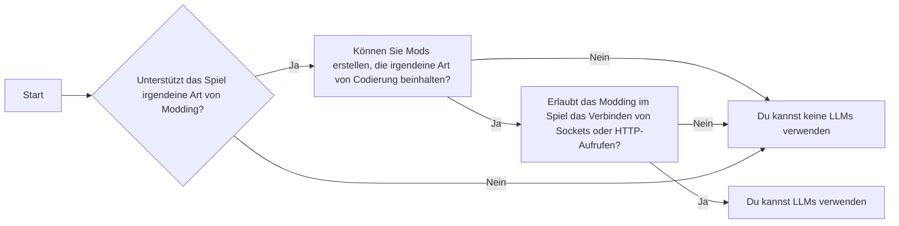

# LLM Modding 101

  
  

## Einführung

In diesem Abschnitt werde ich die Grundlagen des Modding mit LLM diskutieren. Einige Teile könnten zu offensichtlich sein, um sie zu erwähnen, aber da dies eher eine allgemeine Anleitung ist, denke ich, dass ich fast alles erwähnen sollte, was mir in den Sinn kommt. Für die "Duh"-Teile, fühlen Sie sich frei zu überspringen und weiterzulesen.

Modding mit LLM ist eine ausgezeichnete Möglichkeit, um Ihren Spielen lebensechtere Gespräche und unvergessliche Momente hinzuzufügen. LLMs können verwendet werden, um Dialoge, Beschreibungen und sogar ganze Geschichten zu generieren. Sie können auch dazu verwendet werden, um neue Charaktere, Orte und Quests zu erstellen.

Hier sind einige der Vorteile des Modding mit LLMs:

- LLMs können realistischere und ansprechendere Dialoge generieren als traditionelle Skriptmethoden.
- LLMs können komplexe und unvergessliche Charaktere kreieren, die die Spieler lieben werden.
- LLMs können verwendet werden, um neuen Inhalt für Ihr Spiel zu generieren, wie Geschichten, Quests und Orte.
- LLMs können verwendet werden, um die allgemeine Qualität des Schreibens in Ihrem Spiel zu verbessern.

## Einige Hintergrundinformationen zu LLMs

### Was ist LLM?
LLM, oder in anderen Worten, Large Language Models, sind Modelle, die auf einem riesigen Datensatz von Text und Code trainiert wurden.

### Was ist GPT?
GPT steht für Generative Pre-trained Transformer. GPT ist eine Form von LLM. GPT kann verwendet werden, um Text zu generieren, Sprachen zu übersetzen, verschiedene Arten von kreativen Inhalten zu schreiben und Ihre Fragen auf informative Weise zu beantworten.

### Warum bekommt GPT so viel Aufmerksamkeit?
GPT bekommt so viel Aufmerksamkeit, weil es eines der leistungsstärksten und vielseitigsten Sprachmodelle ist, die jemals erstellt wurden. Es kann für eine Vielzahl von Aufgaben verwendet werden, einschließlich der Generierung von realistischen und ansprechenden Dialogen, der Erstellung von komplexen und unvergesslichen Charakteren und dem Schreiben von neuem Inhalt für Spiele.

### Wird GPT anstelle von LLMs verwendet?
GPT ist eine Art von LLM, daher wird es nicht anstelle von LLMs verwendet. Allerdings wird GPT oft anderen LLMs vorgezogen, da es sehr einfach zu bedienen ist, da es über eine öffentliche API von OpenAI (GPT 3.5+) verfügbar ist.

### Warum konzentriert sich dieser Leitfaden hauptsächlich auf LLMs?
Dieser Leitfaden konzentriert sich hauptsächlich auf LLMs, da das Modding mit LLMs heutzutage ein recht neues Thema ist und einige gemeinsame Schlüsselpunkte aufweist, die man unabhängig vom Spiel, das man modded, befolgen muss.

### Wie nutzt man neuronale Netzwerke ohne GPT oder irgendein LLM?
Es gibt viele Möglichkeiten, neuronale Netzwerke ohne GPT oder irgendein LLM zu nutzen. Zum Beispiel können Sie neuronale Netzwerke verwenden, um Bilder zu klassifizieren, Musik zu generieren oder Sprachen zu übersetzen.
Um ein neuronales Netzwerk zu nutzen, müssen Sie es auf einem Datensatz von Daten trainieren. Wenn Sie ein neuronales Netzwerk zur Bildklassifizierung nutzen möchten, müssen Sie es auf einem Datensatz von Bildern trainieren. Sobald das neuronale Netzwerk trainiert ist, können Sie es verwenden, um Vorhersagen über neue Daten zu treffen. Zum Beispiel könnten Sie, wenn Sie ein neuronales Netzwerk zur Bildklassifizierung trainiert haben, es verwenden, um neue Bilder zu klassifizieren, die Sie noch nie zuvor gesehen haben.

### Was ist ein Charaktermotor?
Charaktermotoren helfen Entwicklern dabei, die benötigte Zeit, den Aufwand und die Ressourcen für die Erstellung KI-gesteuerter NPCs drastisch zu reduzieren. Im Wesentlichen ist es wie eine Spiel-Engine, aber für die generative KI-Charaktererstellung.

### Die größten Herausforderungen der LLMs
LLMs stehen vor mehreren bedeutenden Herausforderungen, darunter:

* **Bias:** LLMs können Bias aufweisen, der die in den Daten, auf denen sie trainiert wurden, vorhandenen Vorurteile widerspiegelt.
* **Sicherheit:** LLMs können dazu verwendet werden, schädliche Inhalte zu generieren, wie Hassreden oder Fehlinformationen.
* **Kosten:** Das Training und die Bereitstellung von LLMs können teuer sein.

### Warum das Training Ihres eigenen neuronalen Netzwerks aufgrund von Daten und Wissen herausfordernd sein kann

Das Training Ihres eigenen neuronalen Netzwerks kann aufgrund der Anforderungen an Daten und Wissen herausfordernd sein. Neuronale Netzwerke müssen auf einer großen Menge von Daten trainiert werden, und das Sammeln von genügend Daten für ein effektives Training kann schwierig und teuer sein.

Außerdem erfordert es Kenntnisse in Maschinenlernen und neuronalen Netzwerken, um erfolgreich Ihr eigenes neuronales Netzwerk zu trainieren. Wenn Sie dieses Wissen nicht haben, kann das Training eines neuronalen Netzwerks eine herausfordernde Aufgabe sein.

## Wie Sie entscheiden können, ob Sie LLMs verwenden können?

Modding mit LLM ist nicht für jedes Spiel geeignet. Hier sind einige Dinge, die Sie in Betracht ziehen sollten, bevor Sie entscheiden, ob Sie Ihr Spiel mit LLM modden sollten:

* **Ist Ihr Spiel modifizierbar?** Nicht alle Spiele sind modifizierbar. Einige Spiele haben eine eingebaute Mod-Unterstützung, während andere Drittanbieter-Tools benötigen. Wenn Ihr Spiel nicht modifizierbar ist, werden Sie nicht in der Lage sein, LLM zur Modifizierung zu verwenden.
* **Hat Ihr Spiel eine Modding-Community?** Nicht alle Spiele haben eine Modding-Community, und selbst wenn sie eine haben, ist die Community vielleicht nicht aktiv oder unterstützend. Wenn es keine Modding-Community für Ihr Spiel gibt, wird es schwieriger sein, Hilfe und Unterstützung zu finden, wenn Sie auf Probleme stoßen. Besonders wenn Sie kein erfahrener Modder für dieses Spiel sind.
* **Was sind Ihre Ziele?** Was erhoffen Sie sich von der Modifizierung Ihres Spiels mit LLM? Möchten Sie die Dialoge verbessern, neue Charaktere hinzufügen oder neuen Inhalt erstellen? Sobald Sie Ihre Ziele kennen, können Sie anfangen, darüber nachzudenken, wie Sie LLM am besten einsetzen können, um sie zu erreichen.

## Überprüfen Sie, ob Ihre Entscheidung richtig ist
Bevor Sie mit dem Modding Ihres Spiels mit LLM beginnen, ist es wichtig, sicherzustellen, dass Sie alle notwendigen Tools und Ressourcen haben. Hier sind einige Dinge, die Sie überprüfen sollten:
* **Stellen Sie sicher, dass Sie die neueste Version von LLM haben.** LLM wird ständig aktualisiert, daher ist es wichtig, sicherzustellen, dass Sie die neueste Version haben. Dies liegt normalerweise nicht in Ihrer Kontrolle, wenn Sie Online-Modelle verwenden - was je nach Ziel gut oder schlecht sein kann.
* **Stellen Sie sicher, dass Sie ein gutes Verständnis davon haben, wie man LLM benutzt.** Es gibt viele Tutorials und Ressourcen online, die Ihnen helfen können, zu lernen, wie man LLM benutzt. Wenn Sie Ihren eigenen Server mit einer Version von LLM (Llama etc.) erstellen, dann sollten Sie wissen, wie das funktioniert und Ihre API darum herum anpassen. Beides erfordert ein gewisses Fachwissen.
* **Stellen Sie sicher, dass Sie ein gutes Verständnis der Modding-Tools für Ihr Spiel haben.** Jedes Spiel hat seine eigenen Modding-Tools und -Prozesse, daher ist es wichtig, sicherzustellen, dass Sie wissen, wie man sie benutzt. Wenn Sie nicht wissen, wie man sie benutzt, sollte Ihr erstes Ziel sein, das zu überprüfen und zu lernen. Auch wenn Sie ein erfahrener Modder im Spiel X sind, garantiert das nicht, dass Sie auch im Spiel Y gut sein werden.

## Grundlagen

Um mit dem LLM Modding zu beginnen, müssen Sie ein paar grundlegende Dinge wissen:
* **Prompt-Fähigkeiten:** LLM wird auf einem riesigen Datensatz von Text und Code trainiert, aber es muss immer noch aufgefordert werden, um Text zu generieren. Sie müssen lernen, wie man effektive Prompts schreibt, um die besten Ergebnisse von LLM zu erhalten. Sie können diese Anforderung für bestimmte Dienste (wie [Inworld Charaktermotor](http://inworld.ai?utm_campaign=bloc-modding-guide)) eliminieren, aber wenn Sie planen, Ihr eigenes System zu verwenden, ist dies ein Muss.
* **Programmierkenntnisse:** Einige LLM-Modding erfordert Programmierkenntnisse. Zum Beispiel müssen Sie möglicherweise Code schreiben, um LLM in Ihr Spiel zu integrieren oder benutzerdefinierte Prompts zu erstellen.

Sobald Sie ein grundlegendes Verständnis von LLM und Programmierung haben, können Sie anfangen, mit dem Modding Ihres Spiels zu experimentieren. Es gibt viele Möglichkeiten, wie Sie LLM zum Modding Ihres Spiels verwenden können, also seien Sie kreativ und haben Sie Spaß!

Hier sind einige zusätzliche Tipps für das LLM Modding:

* **Fangen Sie klein an.** Versuchen Sie nicht, Ihr ganzes Spiel auf einmal zu modden. Beginnen Sie damit, einen kleinen Teil Ihres Spiels zu modden, wie einen einzelnen Charakter oder eine Quest. Dies wird Ihnen helfen, die Seile zu lernen und potenzielle Probleme zu identifizieren.
* **Testen Sie oft.** Sobald Sie einige Änderungen an Ihrem Spiel vorgenommen haben, sollten Sie diese gründlich testen. Dies wird Ihnen helfen, Fehler oder Probleme zu identifizieren, die Sie möglicherweise verursacht haben.
* **Holen Sie sich Feedback von anderen.** Sobald Sie Ihre Änderungen getestet haben, teilen Sie sie mit anderen und holen Sie sich ihr Feedback. Dies wird Ihnen helfen, Bereiche zu identifizieren, in denen Ihre Mod verbessert werden kann.

LLM Modding kann viel Spaß machen, und es kann eine großartige Möglichkeit sein, Ihre Spiele zu verbessern. Mit ein wenig Aufwand können Sie Mods erstellen, die Ihre Spiele für Sie und andere angenehmer machen.
