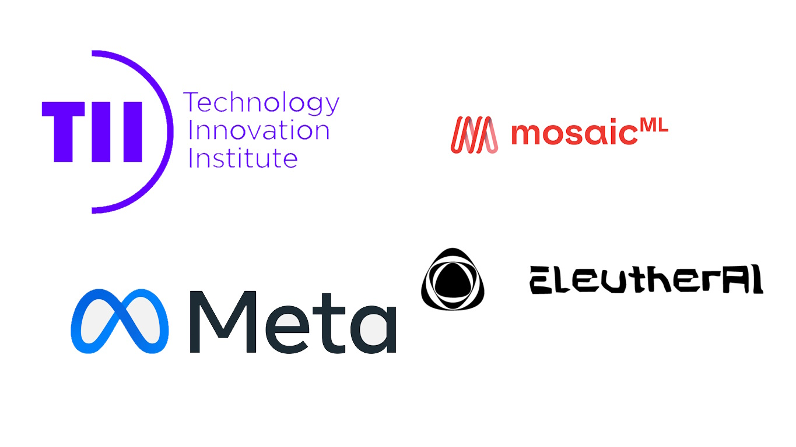

# LLM Modding 301  
  

  
    

  
  
## Auswahl Ihres Modells oder Dienstes  
  
Wenn es um die Auswahl Ihres Modells oder Dienstes geht, haben wir heutzutage mehrere Optionen. Darüber hinaus werden nach Abschluss dieses Dokuments wahrscheinlich weitere Optionen auftauchen, daher schlage ich vor, diese Liste als Momentaufnahme von heute zu verwenden, anstatt als vollständig aktuelle Liste. Wenn Sie unsicher sind, was Dienste oder Online-Modelle sind, besuchen Sie bitte [LLM Modding 201](https://bloctheworker.github.io/llm-modding-guide/de/201), um einen Überblick darüber zu bekommen.  
  

  
  
## Mögliche Auswahlmöglichkeiten ab Oktober 2023  
  
## Lokale Modelle  
  

  

Es gibt VIELE lokale Modelle, die meist von Basis-Modellen mit Feinabstimmung abgeleitet sind. Hier werde ich die wichtigsten Basis-Modelle auflisten:  
  
* **Falcon:**  
Falcon ist eine Reihe von generativen Großsprachmodellen (LLMs), die vom Technologie-Innovationsinstitut (TII) in Abu Dhabi entwickelt wurden. Falcon-Modelle verwenden Multiquery-Aufmerksamkeit und eine benutzerdefinierte Datenpipeline, um eine hohe Leistung und Skalierbarkeit zu erzielen. Falcon-Modelle können Texte in verschiedenen Bereichen und Aufgaben generieren.  
  
* **LLaMA:**  
LLaMA ist ein Akronym für Large Language Model Meta AI, eine Reihe von grundlegenden Großsprachmodellen (LLMs), die von Meta (ehemals Facebook) veröffentlicht wurden. LLaMA-Modelle werden auf einem großen Datensatz von 20 Sprachen mit lateinischen und kyrillischen Alphabeten trainiert. LLaMA-Modelle verwenden Rotationspositions-Einbettungen und parallele Berechnungen, um Effizienz und Vielseitigkeit zu verbessern. LLaMA 2 wurde kürzlich Open-Source.  
  
* **MPT:**  
MPT steht für MosaicML Pretrained Transformer, eine Reihe von Großsprachmodellen (LLMs), die von MosaicML entwickelt wurden, einer Plattform zum Aufbau und Einsatz von maschinellen Lernmodellen. MPT-Modelle verwenden eine modifizierte Transformer-Architektur mit ALiBi (Aufmerksamkeit mit linearen Voreingenommenheiten) und FlashAttention, um Kontextlängenbeschränkungen zu beseitigen und die Geschwindigkeit zu optimieren. MPT-Modelle werden auf einer Mischung von Text- und Code-Daten trainiert und können für verschiedene Aufgaben feinabgestimmt werden.  
  
* **GPT-J:**  
GPT-J ist ein Open-Source-Großsprachmodell (LLM), das 2021 von EleutherAI entwickelt wurde. Es handelt sich um ein generatives vortrainiertes Transformer-Modell, das darauf ausgelegt ist, menschenähnlichen Text zu erzeugen, der von einem Prompt ausgeht. Es hat 6 Milliarden Parameter und verwendet dichte Aufmerksamkeit, Rotationspositions-Einbettungen und parallele Berechnungen. Es wurde auf dem Pile-Datensatz trainiert, der Text aus verschiedenen Quellen und Bereichen enthält.  
  
* **GPT-Neo:**  
Eine Open-Source-Replikation von GPT-3 mit 2,7 Milliarden Parametern, die Texte in verschiedenen Bereichen und Aufgaben generieren kann. GPT-Neo ist ein Open-Source-Großsprachmodell (LLM), das 2021 von EleutherAI entwickelt wurde. Es handelt sich um ein Modell paralleles GPT-2 und GPT-3-Style-Modell, das die mesh-tensorflow-Bibliothek verwendet. Es kann Texte in verschiedenen Bereichen und Aufgaben generieren, wie z.B. das Verständnis natürlicher Sprache, die Generierung natürlicher Sprache und künstliche Konversation. Es hat zwei Versionen: eine mit 1,3 Milliarden Parametern und eine andere mit 2,7 Milliarden Parametern. Es verwendet lokale Aufmerksamkeit in jeder zweiten Schicht mit einer Fenstergröße von 256 Tokens. Es wurde auf dem Pile-Datensatz trainiert, der Texte aus 26 verschiedenen Quellen enthält, wie z.B. Bücher, Nachrichten, Wikipedia und Code.  
  
Neben diesen Basis-Modellen hostet Hugging Face eine Vielzahl von Open-Source-feinabgestimmten Modellen für fast jedes dieser Basis-Modelle. Sie können sie [hier](https://huggingface.co/models?other=text-generation-inference&sort=trending) finden.  
  

  
  
## Online-Modelle  

  

Ich werde nur Online-Modelle auflisten, die über eine API genutzt werden können. Das bedeutet, dass Bard oder Bing Chat nicht Teil dieser Liste sein werden.  
  
* **OpenAI:** OpenAI bietet eine Vielzahl von Produkten und Diensten an, wie z.B. GPT-4, ChatGPT 3.5 Turbo und andere Tools wie DALL·E, ein generatives Modell, das Bilder aus Textbeschreibungen erstellt, und OpenAI Whisper, das Audio in Text transkribiert (ideal für STT-Transformation). Die OpenAI-API kann für unsere LLM-Modding-Zwecke genutzt werden, vorausgesetzt, der Benutzer stellt seine Anmeldedaten oder API-Schlüssel zur Kommunikation mit den Servern zur Verfügung.  
  
* **MosaicML:** MosaicML ist eine Plattform zum Aufbau und Einsatz von generativen KI-Modellen auf Ihren Daten innerhalb Ihrer sicheren Umgebung. MosaicML bietet die MPT Foundation Series, eine Reihe von Open-Source-, kommerziell lizenzierten LLMs, die direkt eingesetzt oder auf Ihren Daten feinabgestimmt werden können. MosaicML Inference ist ein Dienst, der es Ihnen ermöglicht, LLMs sicher zu implementieren, für bis zu 15x Kosteneinsparungen, und MosaicML Training ist ein Dienst, der es Ihnen ermöglicht, Ihre eigenen state-of-the-art Modelle mit einem einzigen Befehl vorzutrainieren oder feinabzustimmen und über mehrere Clouds hinweg zu orchestrieren.  
  
* **DeepInfra:** DeepInfra ist ein serverloser Inferenzdienst, der Zugang zu einer Vielzahl von LLMs und Einbettungsmodellen bietet. Sie können Llama 2, GPT-J, GPT-Neo und Falcon-Modelle dort als API-Endpunkte verwenden.  
  
* **Replicate:** Replicate ist eine Plattform, die es Ihnen ermöglicht, Open-Source-Maschinenlernmodelle mit einer Cloud-API auszuführen. Replicate hat eine Community von Maschinenlernbegeisterten, die tausende von Modellen geteilt haben, einschließlich Sprachmodelle, Videoerstellungs- und Bearbeitungsmodelle, Superauflösungsmodelle, Bildrestaurierungsmodelle, Bild-zu-Text-Modelle und Text-zu-Bild-Modelle. Replicate bietet auch Cog an, ein Open-Source-Tool, das es Ihnen ermöglicht, Maschinenlernmodelle in einem standardisierten, produktionsbereiten Container zu verpacken. Sie können Llama2, GPT-J und Falcon in Replicate ebenfalls ausführen.  
  

  
  
## Service-Modelle  

  

Ich werde nur die Service-Modelle auflisten, die ich kenne, ob namentlich oder aus Erfahrung, aber das ist keineswegs eine vollständige Liste. Fühlen Sie sich frei, einen Pull-Request zu machen, wenn Sie diese Liste erweitern möchten.  
  
* **Inworld AI**:  
Inworld AI ist der führende Character Engine für AI-NPCs. Es ermöglicht Nicht-Spieler-Charakteren (NPCs) in Spielen und virtuellen Welten intelligenten Dialog, macht sie intelligenter und menschenähnlicher und erhöht ihre Fähigkeit, mit Benutzern zu interagieren. Wenn Sie Inworld verwenden, erhalten Sie out-of-the-box LLM-Charakterunterstützung, Text-to-Speech mit mehreren realistischen Stimmen, Speech-to-Text-Unterstützung für Mikrofon-Transkriptionsgespräche, Emotionen und ein Aktionssystem (für die Herstellung von interaktiven Mods). Inworld bietet all dies auch kostenlos in ihrer Free-Tier an, die jeder Benutzer nutzen kann, ohne sogar Kreditkarteninformationen angeben zu müssen. Die Free-Tier bietet 5.000 kostenlose API-Interaktionen pro Monat, was für jeden Mod ausreicht (nach meiner Erfahrung). Sie bieten auch unbegrenzte In-Studio-Interaktion an, die es Benutzern ermöglicht, bestimmte Dinge auf ihrem Portal zu besprechen oder anzupassen, ohne etwas extra zu bezahlen. Sie haben mehrere SDKs für bestimmte Spiel-Engines, die für Modder nicht super hilfreich sein können, aber sie haben auch ein Node.js SDK und direkte Endpunktaufrufe, die leicht genutzt werden können. Sie bieten auch Lipsync-Daten an, falls Ihr Spiel dies unterstützt. Nicht nur das, sie haben auch nahtlose Unterstützung für die Stimmen von elevenlabs, falls Sie qualitativ hochwertige Stimmen auf elevenlabs haben, können diese leicht genutzt werden.  
  
* **ChatFAI**:  
ChatFAI ist eine AI-gesteuerte Chatbot-Plattform, die es Benutzern ermöglicht, Gespräche mit ihren Lieblingscharakteren aus Filmen, Fernsehserien, Büchern und mehr zu führen. Es verwendet Algorithmen zur Verarbeitung natürlicher Sprache, um Antworten auf Benutzereingaben zu generieren. Sie unterstützen die Erstellung von benutzerdefinierten Charakteren. Sie haben auch einen kostenlosen Plan; jedoch ist ihr kostenloser Plan für den tatsächlichen Mod-Gebrauch (Stand September 2023) nicht nutzbar, da er nur 250 Nachrichten pro Monat bietet, was ziemlich begrenzt ist.  
  
* **character.ai**:  
character.ai ist ein Unternehmen, das den Science-Fiction-Traum von offenen Gesprächen und Zusammenarbeiten mit Computern zum Leben erweckt. Es handelt sich um eine Chatbot-Webanwendung mit einem neuronalen Sprachmodell, das Textantworten erzeugen kann, die wie die von echten Menschen klingen und eine natürliche Konversation ermöglichen. Es kann für Vorstellungskraft, Brainstorming und Sprachenlernen verwendet werden. Es ist technisch gesehen kostenlos bei der Anmeldung und scheint keine Nachrichtenbegrenzung zu haben. Sie bieten das c.ai+ Modell an, das schnellere Antwortzeiten und Prioritätszugang bietet (weil einige Charaktere eine Wartezimmer benötigen, wenn sie zu hoch gefragt sind). Leider bieten sie keine offizielle API an und Sie müssen eine Open-Source-inoffizielle Version verwenden, die jederzeit brechen kann, was sie weniger geeignet für Langzeit-Unterstützungs-Mods macht. Sie haben kein TTS/SST-System.  
  
* **convai**:  
Convai ist sehr ähnlich zu Inworld AI; jedoch scheinen sie nicht die gleichen Funktionen wie Inworld zu haben. Derzeit bieten sie auch eine Free-Tier an, aber das Limit ist möglicherweise nicht für jeden ausreichend, da es sich um ein pro Tag 100 Interaktionen-Kontingent handelt. Jede Nachricht gilt als eine Interaktion. Dies kann bestimmte Nutzungen für viele Mods einschränken. Sie bieten auch SST/TTS an wie Inworld, und convai scheint insgesamt eine bessere Sprachqualität zu haben. Sie bieten auch bestimmte Plugins für Spiel-Engines wie Inworld an und sie bieten auch einen direkten Charaktererstellungsendpunkt an (was eine ausstehende Funktion bei Inworld ist). Sie sind derzeit Partner von Nvidia, was wichtig zu beachten ist.  
  
* **Kamoto.AI**:  
Kamoto.AI ermöglicht es Prominenten, Influencern und Benutzern, maßgeschneiderte KI-Charaktere zu erstellen, zu trainieren und zu monetarisieren. Leider scheinen sie keine API bereitzustellen, so dass Sie wahrscheinlich Ihr eigenes inoffizielles Paket schreiben müssen, was oft eine Menge Arbeit ist.  
  
* **NPCx**:  
NPCx ist ein globales Team von Computeringenieuren, Datenwissenschaftlern, Künstlern und Animatoren, die die nächste Generation von Künstlicher Intelligenz (KI) Technologie nutzen, um die digitalen Geschichtenerzähler unserer Zeit zu unterstützen. Sie konzentrieren sich auf Nicht-Spieler-Charaktere (NPCs) in Videospielen und zielen darauf ab, reichere, vielfältigere und lebensechtere 3D-Erfahrungen in einem Bruchteil der Zeit und Kosten zu bieten. Es sind nicht viele Informationen verfügbar außer diesen. Sie haben keine öffentliche Anmeldung und verlangen, dass Sie sie kontaktieren. Nicht genau nutzbar in diesem Fall ab September 2023, sieht aber vielversprechend aus.  
  

  
  
## Warum macht Inworld Sinn?  
  
Basierend auf meiner Erfahrung als Mod-Inhaber kann ich mit Sicherheit sagen, dass viele Menschen weder die Zeit noch die Neigung haben, sich durch lange Installationsanleitungen zu lesen. Viele ignorieren die gesamte Beschreibung und versuchen, den Mod direkt zu installieren. In einer solchen Situation ist das Letzte, was Sie wollen, eine Menge komplizierter Installationsanleitungen hinzuzufügen, die die Benutzer möglicherweise nicht abschließen oder nach Abschluss feststellen, dass ihre Hardware nicht leistungsfähig genug ist. Mehr Schritte == mehr Bugs, was mehr Arbeit für den Mod-Inhaber bedeutet. In Anbetracht dessen, dass ich nicht bereit bin, hohe Cloud-Computing-Gebühren zu zahlen, sind lokale Modelle für mich keine Option. Die nächste Wahl sind Online-Modelle, aber diese erfordern ein Vorabtraining der Modelle für bessere Antworten. Sie sind oft für Entwickler konzipiert, was den Anmelde-/Einrichtungsprozess für durchschnittliche Spieler unattraktiv macht. Unter diesen Bedingungen werden Service-Modelle zur logischsten Wahl.  
  
Aus der Liste sticht Inworld mit seiner Free-Tier und der Feature-Kombination heraus. Ich muss zugeben, dass ich hier voreingenommen bin, da ich Inworld in vielen meiner Mods verwendet habe und sie mir mehrere Monate lang ein kostenloses Entwicklerkonto zur Verfügung gestellt haben. Aber meine Mods wurden von tausenden von Menschen heruntergeladen und gespielt, und ich weiß sicher, dass die meisten von ihnen es völlig kostenlos genossen haben, ohne irgendwo ihre Kreditkartendetails angeben zu müssen. Zu wissen, dass Inworld den Spielern diese Flexibilität bietet, ist einer der Hauptgründe, warum ich mich dafür entscheide, mit Inworld weiterzumachen. Im nächsten Kapitel werden wir über Details zur Nutzung von Inworld sprechen.  
