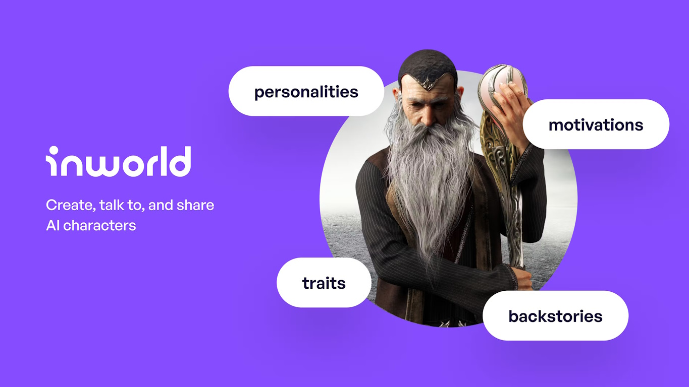
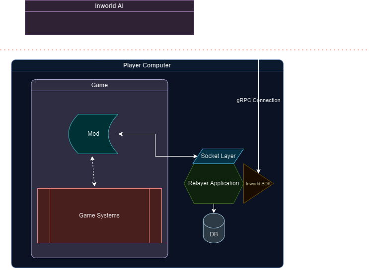

# LLM Modding 401

  

#### Warum Inworld?
Falls Sie wissen möchten, warum dieser Abschnitt mit Inworld AI fortgesetzt wird, werfen Sie bitte einen Blick auf den [Abschnitt 301](https://bloctheworker.github.io/llm-modding-guide/de/301), um den Vergleich zwischen den Diensten und möglichen Ansätzen zu sehen. Wenn alle Vor- und Nachteile abgewogen sind, glaube ich, dass Inworld als die beste Option hervorgeht, und das ist der Grund, warum ich Inworld in fast allen meinen Produktionsmods verwendet habe.

## Über Inworld

Auf den ersten Blick könnten Sie sich fragen: "Wie kann ich das in meinem Mod verwenden, während die Hauptzielgruppe von Inworld anscheinend Spieleentwickler sind?" Und Sie wären berechtigt, so zu denken. Technisch gesehen scheint das Hauptziel von Inworld ein Ein-Entwickler-Abonnement zu sein, das alle Benutzer nutzen können, ohne Inworld überhaupt zu sehen. Wie Sie jedoch vermuten können, ist dies wirtschaftlich für keinen Mod-Ersteller machbar, es sei denn, Sie berechnen Ihren Benutzern etwas, was Mods eher zu einem abonnementbasierten DLC als zu einem Mod macht. Ich werde in diesem Abschnitt nicht auf die Preisdetails von Inworld eingehen, da sie immer Feedback von den Kunden sammeln und ihre Preise entsprechend aktualisieren. Daher besteht eine hohe Chance, dass zum Zeitpunkt des Lesens dieses Artikels die Preise von Inworld AI sogar noch erschwinglicher sein können als das aktuelle System. Aber insgesamt ist die Preispolitik von Inworld benutzerfreundlich genug, dass Sie Benutzern erlauben können, ein Konto zu erstellen und es für eine beträchtliche Zeit völlig kostenlos zu nutzen.

Im Folgenden werde ich Vor- und Nachteile auflisten. Dies wird jedoch keine Wiederholung des vorherigen Abschnitts 301 sein; vielmehr werde ich mich hier ausschließlich auf DevEx konzentrieren.

### Vorteile

**Ein Service, um sie alle zu beherrschen:** Stellt fast alle benötigten Werkzeuge in seinem Funktionsumfang zur Verfügung, so dass Sie sich nicht für verschiedene Dienste einzeln anmelden müssen.

**Nicht-Ausgrenzendes UX/UI:** Obwohl sie sich hauptsächlich auf Entwickler/Spielentwickler konzentrieren, ermutigt ihre Benutzeroberfläche und Benutzererfahrung normale Benutzer dazu, herumzuspielen und sich mit dem System vertraut zu machen. Dies ist kein direkter Vorteil für Sie als Mod-Entwickler, hilft aber indirekt sehr, weil es viele "Wie kann ich dies und das tun" Fragen entfernt.

**Preisgestaltung:** Es mag nicht völlig kostenlos sein, aber es ist definitiv *kostenlos* genug, um zu entwickeln und den Spielern zur Verfügung zu stellen. Es ist auch sehr einfach für Spieler, ihr Konto für mehr Interaktionszeit zu erweitern, ohne dass der Mod-Entwickler Änderungen vornehmen muss.

**Engagement:** Falls Sie Fragen haben, engagieren sich die Entwickler tatsächlich mit Ihnen in ihrem Discord-Kanal. Das ist besonders gut für diejenigen, die neu in der LLM Modding sind. Sie helfen Menschen von LLM Aufforderungsleitfäden bis hin zu technischen Dingen.

### Nachteile

**Protokoll und SDKs:** Das ausgewählte Protokoll (gRPC) passt nicht gut zu Mods, die bereits in Bezug auf ihren Technologie-Stack etwas eingeschränkt sind. Außerdem sind die SDKs hauptsächlich auf beliebte Spiel-Engines wie Unreal oder Unity ausgerichtet, aber 95% der Mods haben keine direkte Interaktion mit diesen Engines, auch wenn das Spiel mit diesen Engines gemacht wurde.

**Fehlende APIs:** Leider fehlen Inworld einige sehr wichtige APIs, wie das Erstellen, Aktualisieren oder Löschen von Charakteren/Gehirnen über einen API- oder SDK-Aufruf. Ich weiß jedoch, dass Inworld sich dessen bewusst ist und sie bereits begonnen haben, daran zu arbeiten, so dass dies zum Zeitpunkt des Lesens dieses Artikels sehr wahrscheinlich kein Problem mehr ist.

 

  

## Erste Schritte mit Inworld AI

Dank ihres Preismodells und Anmeldesystems ist das Ausprobieren von Inworld super einfach. Gehen Sie einfach auf [inworld.ai](https://www.inworld.ai/) und erstellen Sie Ihr Konto, indem Sie auf "Get Started" klicken. Von dort aus stellt Ihnen Inworld einen Arbeitsbereich zur Verfügung, der bestimmte Charaktere als Demo-Charaktere enthält.

Ich würde dringend empfehlen, zuerst mit ihnen zu interagieren, um ein Gefühl für das gesamte Erlebnis zu bekommen. Sobald Sie das Gefühl haben, genug Interaktion gehabt zu haben, schauen Sie sich ihre Beschreibungen, Ziele und mehr an. Anders als bei anderen Modellen erwartet Inworld nicht, dass Sie einen großen beschreibenden Absatz verfassen, der sorgfältig über Tage hinweg erstellt wurde. Stattdessen trennen sie die Bedenken und Punkte in verschiedene Abschnitte, so dass Sie sie auf eine organisierte Weise ausfüllen können. Darüber hinaus macht Inworld einen ausgezeichneten Job mit ihrer Charaktererstellung UI, indem sie grundlegende und fortgeschrittene Konzepte unterscheidet. Zum Beispiel ist die Kernbeschreibung ein grundlegendes Merkmal, das alle Charaktere haben müssen, während Persönlichkeit und Emotionen fortgeschrittenere Merkmale sind als ein grundlegender Charakter braucht.

Um kurz Informationen über jeden Abschnitt zu geben:

- Kernbeschreibung: Dies ist die grundlegende Struktur Ihres Charakters, einschließlich seiner Geschichte, aktuellen Situation und Persönlichkeitsmerkmale. Diese Beschreibung ist von entscheidender Bedeutung und wird vom LLM sehr ernst genommen. Es ist ratsam, in diesem Abschnitt keine vorübergehenden Informationen aufzunehmen, da diese Beschreibung in gewisser Weise in die Seele des Charakters eingraviert ist.

- Mängel: Diese stellen die Schwächen und Verletzlichkeiten des Charakters sowie die Motivationen dar. Diese können verwendet werden, um den von Ihnen erstellten Charakter zu vertiefen.

- Dialogstil: Inworld bietet eine Reihe von sehr nützlichen Optionen, wenn Sie nicht jeden Dialog des Charakters von Hand gestalten möchten. Wenn Sie jedoch ernst werden wollen, sollten Sie einen benutzerdefinierten Dialogstil hinzufügen. Nach meinen Beobachtungen liefert er konsequent die besten Antworten.

- Sprachparameter: Dies ist wahrscheinlich der verständlichste Abschnitt. Eine Sache, die man beachten sollte, ist, dass er mit einer out-of-the-box Elevenlabs-Integration kommt. Das bedeutet, dass, wenn Sie (oder der Spieler) möchten, Sie jede Elevenlabs-Stimme, die Sie haben, klonen oder verwenden und hier integrieren können. Wenn Sprachdaten durchgegeben werden, wird in diesem Fall Elevenlabs verwendet.

Weiter zu den erweiterten Funktionen: Persönlichkeit, Wissen, Ziele, Szenen und Beziehungen.

- Persönlichkeit: Wie der Name schon sagt, bezieht sich dieser Abschnitt auf die Persönlichkeit unserer Charaktere. Hier können Sie den Charakter negativer, fröhlicher, ängstlicher usw. klingen lassen. Die emotionale Engine innerhalb von Inworld wird durch die Persönlichkeit gesteuert und formt das Verhalten eines Charakters, indem sie den Bereich ihrer Emotionen mit Adjektiven und Schiebereglern definiert.

- Wissen: Antworten auf Benutzeranfragen werden durch Fakten und Wissen bereitgestellt. Charakterspezifische Informationen fallen unter Persönliches Wissen, während Allgemeines Wissen über mehrere Charaktere geteilt wird und bei der Welterschaffung hilft. Sie sind wichtig, wenn Ihre Charaktere nicht in der realen Welt angesiedelt sind. Sie können die KI immer noch nicht vollständig "isolieren", indem Sie viel allgemeines Wissen hinzufügen, aber je mehr Informationen Sie eingeben, desto besser angepasste Antworten werden Sie erhalten.

- Ziele: Diese Funktion ist außerordentlich leistungsfähig und ermöglicht das Auslösen spezifischer Aktionen durch vordefinierte Wörter oder Absichten. Ich empfehle dringend, ihre Dokumentation für weitere Details zu erkunden.

- Szenen: Ich habe ihr Potenzial noch nicht vollständig erfasst und habe sie nicht viel genutzt. Im Grunde genommen gibt sie den Charakteren ein Gefühl für ihren aktuellen Standort. Da meine Modifikationen meist auf dynamischen Einstellungen basierten, erwiesen sich Szenen für mich nicht als sehr nützlich. Wenn Sie sich jedoch auf statische Szenen konzentrieren, lohnt es sich, tiefer einzutauchen.

- Beziehungen: Beziehung ist ein neues Feature, das die Entwicklung von Beziehungen zwischen NPCs und Spielern über verschiedene Spielsessions hinweg ermöglichen soll. Im Grunde bedeutet das eine "progressive" Beziehung zwischen Spieler und Charakter.

Für weitere Details können Sie [ihre Dokumentation überprüfen](https://docs.inworld.ai/docs/intro).

### Architektur

!!! Tipp "Hinweis"
    Wenn Ihr Spiel-Modding eine ordnungsgemäße NDK-Integration unterstützt und Sie Erfahrung in der NDK-Entwicklung haben, schauen Sie sich bitte das Inworld NDK-Entwicklungskit an. Es könnte 10x effizienter sein als die hier beschriebene Architektur. Siehe [inworld-ai/inworld-ndk](https://github.com/inworld-ai/inworld-ndk).

Normalerweise erlauben Spiele nicht das Ausführen verschiedener DLLs in ihrer Umgebung, es sei denn, Sie wissen, was Sie tun und modifizieren den Kern des Spiels bis ganz nach unten. Deshalb ist es oft besser, einen Sidecar-Ansatz zu verwenden.

Wenn Sie zuvor mit meinen Mods gespielt haben, haben Sie wahrscheinlich bemerkt, dass es immer erfordert, dass Sie vor dem Start des Spiels ein "Terminal" im Hintergrund sehen. Der Hauptgrund dafür ist, dass dieses "Terminal" im Grunde ein eingepackter Node.js Socket Server ist, der das vorhandene Inworld SDK nutzt. Natürlich können Sie, abhängig von Ihrer Implementierung und Anforderungen, diese Anforderung komplett entfernen und den Mod direkt in das Spiel selbst integrieren.

Ich glaube, das obige Bild erklärt die Architektur deutlich. Um jedoch etwas mehr Kontext zu geben:
Das Spiel interagiert nie direkt mit dem Inworld AI-System; es verwendet die "Relayer Application" als Proxy, um seine Aktionen auszuführen. Im Diagramm wird die Relayer Application als Socket-Schicht dargestellt; je nach Einschränkungen in Ihrem Mod kann es sich jedoch auch um eine einfache REST API handeln.
Solange Ihr Sidecar in der Lage ist, das Inworld SDK zu integrieren, liegt der Rest völlig bei Ihnen. Technisch gesehen können Sie Named Pipes verwenden, um eine Verbindung zwischen der Anwendung und dem Spiel herzustellen. Oder Sie können sogar einige benutzerdefinierte Formate oder provisorische Lösungen wie das Schreiben in eine Datei und das Lesen davon auf der Anwendungsseite verwenden. Dies sollte jedoch die letzte Option sein, da I/O-Operationen schrecklich langsam sind und zu unerwünschter Verzögerung in der Kommunikation führen können.

Ein weiterer guter Aspekt des Sidecar-Ansatzes ist, dass er technisch gesehen wie ein separater Prozess/Anwendung funktioniert und unabhängig vom Mod mehr Dinge tun kann. Zum Beispiel, wenn das Spiel Ihnen nicht erlaubt, Sounds abzuspielen, können Sie dies im Sidecar handhaben, da es wahrscheinlich eine bessere Chance hat, solche Operationen durchzuführen. Darüber hinaus können Sie auch Ihre eigene kleine Datenbank erstellen, um die Kommunikation zwischen dem Spieler und dem System zu speichern, so dass Sie sich darauf beziehen möchten, einige Daten für die Mod-Nutzung speichern und so weiter. Der Rest liegt wirklich an Ihrer Vorstellungskraft - lassen Sie Ihrer Kreativität freien Lauf! :)

Wenn Sie einen Hinweis benötigen, wie Sie einen Sidecar mit dem Inworld SDK implementieren können, würde ich vorschlagen, folgendes zu überprüfen:

**Offizielle Inworld NodeJS SDK Beispiele** für sowohl JS als auch TS. Dies sollte Ihr Haupt-Einstiegspunkt sein, wenn Sie überhaupt nicht mit Inworld vertraut sind. [Link](https://github.com/inworld-ai/inworld-nodejs-sdk/tree/main/examples)

**Bannerlord Mod** verwendet C# für den Haupt-Bannerlord-Mod + verwendet einen JS-Sidecar mit einer Websocket-Schicht und das Inworld NodeJS SDK. [Link](https://github.com/BlocTheWorker/Inworld-Bannerlord-Mod)

**Skyrim Mod** verwendet C++ für den Haupt-Skyrim-Mod, Papyrus Scripting für spielbezogenes Modding, C# Audiosystem zum Abspielen der Sounds (weil ich das nicht auf der Skyrim oder Node.js-Seite machen wollte) + verwendet die TypeScript-Version des Sidecars, die eine Websocket-Schicht und das Inworld NodeJS SDK verwendet. [Link](https://github.com/BlocTheWorker/Inworld-Skyrim-Mod)

Der **Inworld Discord** Kanal bietet eine großartige Möglichkeit, sich mit anderen Entwicklern zu vernetzen. Sie können Ihre Fragen stellen und etwas Community-Know-how sammeln. Sie müssen das Rad nicht neu erfinden. [Link](https://discord.com/invite/2jGPwV8g3b)

## Bemerkungen

Inworld AI ist ein fantastischer Dienst, und bisher hatte ich viel Spaß damit zu arbeiten. Wie wir im vorherigen Abschnitt 301 und hier skizziert haben, hat es seine Vor- und Nachteile, aber ich würde mit Zuversicht sagen, dass die Vorteile die Nachteile bei weitem überwiegen. Darüber hinaus können Sie Inworld immer Verbesserungsvorschläge machen. Das ist einer der tollen Aspekte, die ich an ihnen schätze - wie zugänglich sie sind. Wenn Sie einen Vorschlag zur Verbesserung des Systems haben, können Sie ihn einfach vorschlagen, und sie hören tatsächlich zu! Natürlich haben sie, wie jedes Unternehmen, ihre eigenen Backlog-Elemente und müssen bewerten, wie sie diese implementieren können. Aber aus einer pragmatischen Sicht hat jede wertvolle Funktion, die sie hinzufügen, einen Nutzen für sie auf lange Sicht. Daher haben sie praktisch keinen Grund, gute Vorschläge abzulehnen. Sie können also immer beruhigt sein, dass jemand daran arbeiten wird, wenn es für ihren Backlog gut genug befunden wird.

Diese gesamte Seite ist darauf ausgerichtet, wie Sie Ihren eigenen Mod mit LLMs erstellen können. Allerdings können Sie die gleichen Ideen und Architekturen auch in Ihren eigenen Spielen anwenden. Natürlich könnten die Systeme technisch anders sein als das, was in diesem Dokument detailliert beschrieben wird, insbesondere da nicht-proprietäre Spiel-Engines mehr Flexibilität bieten als proprietäre, wo das meiste Modding normalerweise stattfindet.

Das war's, Leute! Ich hoffe, dieses Dokument war für einige von Ihnen hilfreich. Mir ist bewusst, dass es viele andere Dienste und Modelle geben könnte, die ich nicht erwähnt habe und die Sie auch ansprechend finden könnten. Allerdings basiert dieser gesamte Text auf meinem Wissen und meinen Erfahrungen. Wenn Sie einen Beitrag leisten möchten oder Vorschläge haben, können Sie dies gerne tun, indem Sie einen Pull-Request erstellen. Wenn Sie diesen Artikel wertvoll fanden und aus einer anderen Sprache kommen, helfen Sie mir bitte, dies in Ihre Sprache zu übersetzen.
