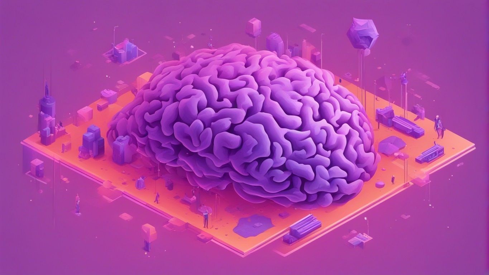
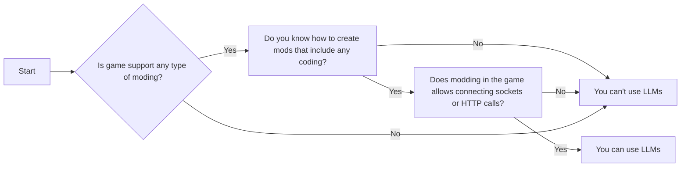

# LLM Modding 101

  

## Introduction

In this section, I will discuss the basics of modding with LLM. Some parts might be too obvious to state, but since this is more of a general guide, I think I should mention almost everything that comes to mind. For the "Duh" parts, feel free to skip and continue reading.

Modding with LLM is an excellent way to add more lifelike conversations and memorable moments to your games. LLMs can be used to generate dialogue, descriptions, and even entire stories. They can also be used to create new characters, locations, and quests.

Here are some of the benefits of modding with LLMs:

- LLMs can generate more realistic and engaging dialogue than traditional scripting methods.
- LLMs can create complex and memorable characters that players will love.
- LLMs can be used to generate new content for your game, such as stories, quests, and locations.
- LLMs can be used to improve the overall quality of your game's writing.

## Some Background

### What is LLM?
LLM, or in other words, Large Language Models, are models that have been trained on a massive dataset of text and code.

### What is GPT?
GPT stands for Generative Pre-trained Transformer. GPT is a form of LLM. GPT can be used to generate text, translate languages, write different kinds of creative content, and answer your questions in an informative way.

### Why is GPT gaining so much attention?
GPT is gaining so much attention because it is one of the most powerful and versatile language models ever created. It can be used for a wide variety of tasks, including generating realistic and engaging dialogue, creating complex and memorable characters, and writing new content for games.

### Is GPT used instead of LLMs?
GPT is a type of LLM, so it is not used instead of LLMs. However, GPT is often preferred over other LLMs because it is very easy to use, since it is available through a public API from OpenAI (GPT 3.5+).

### Why does this guide mostly focus on LLMs?
This guide mostly focuses on LLMs because LLM modding is quite a new topic nowadays, and it shares some common key points that you need to follow regardless of the game you are modding.

### How to use neural networks without using GPT or any LLM?
There are many ways to use neural networks without using GPT or any LLM. For example, you can use neural networks to classify images, generate music, or translate languages.
To use a neural network, you will need to train it on a dataset of data. If you want to use a neural network to classify images, you will need to train it on a dataset of images. Once the neural network is trained, you can use it to make predictions on new data. For example, if you trained a neural network to classify images, you could use it to classify new images that you have never seen before.

### What is a character engine?
Character engines help developers can drastically cut down the time, effort, and resources needed to create AI-driven NPCs. Essentially, it’s like a game engine but for generative AI character creation. 

### The Biggest Challenges of LLMs
LLMs face several significant challenges, including:

* **Bias:** LLMs can exhibit bias, reflecting the biases present in the data on which they are trained.
* **Safety:** LLMs can be used to generate harmful content, such as hate speech or misinformation.
* **Cost:** Training and deploying LLMs can be expensive.

### Why Training Your Own Neural Network Can Be Challenging Due to Data and Knowledge

Training your own neural network can be challenging due to the requirements of data and knowledge. Neural networks need to be trained on a large amount of data, and collecting enough data for effective training can be difficult and expensive.

Additionally, it requires knowledge of machine learning and neural networks to successfully train your own neural network. If you lack this knowledge, training a neural network can be a challenging task.

## Deciding

Modding with LLM is not right for every game. Here are a few things to consider before deciding whether to mod your game with LLM:

* **Is your game moddable?** Not all games are moddable. Some games have mod support built-in, while others require third-party tools. If your game is not moddable, you will not be able to use LLM to mod it.
* **Does your game have a modding community?** Not all games have a modding community, and even if they do, the community may not be active or supportive. If there is no modding community for your game, it will be more difficult to find help and support if you run into problems. Especially if you are not a seasoned modder for that game.
* **What are your goals?** What do you hope to achieve by modding your game with LLM? Are you looking to improve the dialogue, add new characters, or create new content? Once you know your goals, you can start to think about the best way to use LLM to achieve them.

## Double Checking
Before you start modding your game with LLM, it is important to double-check that you have all the necessary tools and resources. Here are a few things to check:
* **Make sure that you have the latest version of LLM.** LLM is constantly being updated, so it is important to make sure that you have the latest version. This is usually not under your control if you are using Online models - which can be good or bad depending on your goal.
* **Make sure that you have a good understanding of how to use LLM.** There are many tutorials and resources available online that can help you learn how to use LLM. If you are creating your own server with some version of LLM(Llama etc) then you should know how that works and tailor your API around that. Both of these requires some expertise.
* **Make sure that you have a good understanding of the modding tools for your game.** Each game has its own modding tools and process, so it is important to make sure that you understand how to use them. If you don't know how to use it, your first aim should be checking and learning that. Even if you are a seasoned modder on game X, it doesn't guarantee that you will be great at game Y.

## Basics

To get started with LLM modding, you will need to know a few basic things:
* **Prompt skills:** LLM is trained on a massive dataset of text and code, but it still needs to be prompted in order to generate text. You will need to learn how to write effective prompts in order to get the best results from LLM. You can eliminate this requirement for certain services (Like [Inworld AI's Character Engine](http://inworld.ai?utm_campaign=bloc-modding-guide)) but if you are planning to use your own system, this is a must.
* **Coding skills:** Some LLM modding will require some coding skills. For example, you may need to write code to integrate LLM into your game or to create custom prompts.

Once you have a basic understanding of LLM and coding, you can start to experiment with modding your game. There are many ways to use LLM to mod your game, so be creative and have fun!

Here are some additional tips for LLM modding:

* **Start small.** Don't try to mod your entire game all at once. Start by modding a small part of your game, such as a single character or quest. This will help you to learn the ropes and to identify any potential problems.
* **Test often.** Once you have made some changes to your game, be sure to test them thoroughly. This will help you to identify any bugs or problems that you may have created.
* **Get feedback from others.** Once you have tested your changes, share them with others and get their feedback. This will help you to identify any areas where your mod can be improved.

LLM modding can be a lot of fun, and it can be a great way to improve your games. With a little effort, you can create mods that will make your games more enjoyable for yourself and for others.