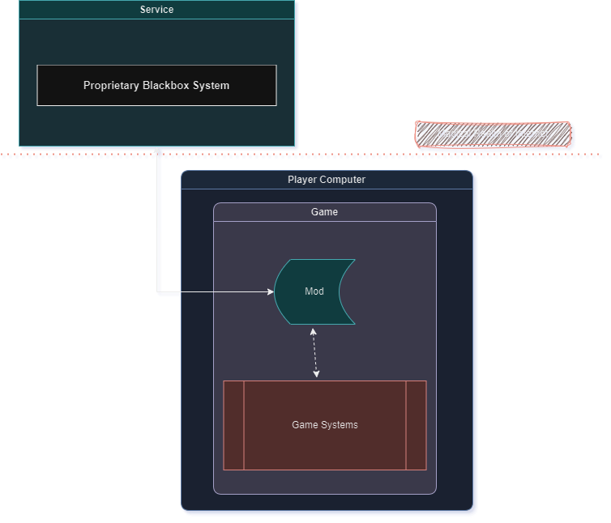

# LLM Modding 201

  

## Local, Online, or Service Models?

When it comes to modding with LLMs, you have multiple options. Though this classification might not be satisfying for some, I want to classify them as such, and here are some details about each:

* Local LLM Models: These are models that run on consumer-grade PCs that don't require any connection to the internet, and the entire computation happens on consumer runtime.
* Online LLM Models: These are models that you need to run online, either because you cannot run them on consumer hardware due to hardware limitations or legal limitations.
* Service LLM Models: These are models that are specialized in certain fields and expose an API for developers to utilize, which takes some cumbersome aspects of LLM systems out of the equation (Example: [Inworld AI](http://inworld.ai?utm_campaign=bloc-modding-guide)).

You probably might have found some models that are a mixture of these categories as well, but there is no need to create a separate category for them. In the following section, I will try to explain all of these category models in detail to the best of my knowledge by laying out the pros and cons of each.

## About Local Models

#### High Level Architecture Type

**Pros:**

Local models are great in a way that they usually don't require a constant internet connection. This is beneficial for users who are concerned about privacy. Moreover, most of the models can be run without any restrictions, allowing less-censored models to be run on mods - which can be great depending on the type of mod concept you have in mind (for example, violence isn't approved by many AI models unless you strip some guard rails). They are also free, given that everything will happen locally, so users don't have to pay anything.

**Cons:**

Often, these local models come in two qualities - models with large parameters and models with small parameters. Large parameter models often require very high-tier hardware to run (like at least 100sGB of RAM and such) and they also take up a very large amount of storage on the hardware. This, as you can expect, isn't appealing to every mod user at the moment, and you would only target a fraction of the player base as mod users. For small parameter models, however, they require less powerful machines in most cases. However, they still require around 16GB of RAM, a good GPU, and fairly large storage. Unfortunately, the quality of the answers from these small parameter models is also very questionable (at least from what I have observed, they are not good). You can find GPT-Q and GGML versions of the models, which can help based on consumer specifications, but still, you need good-tier hardware in each category. GPT-Q is for CUDA inference models (basically GPU) and GGML is designed for CPU. Moreover, there are models that can run on consumer hardware, where it requires 4GB VRAM or 16GB RAM, and you might say "Great, so it works," but you would forget the fact that running the models isn't the only requirement. We need to run the models and the game at the same time, and doing this without impacting game performance (due to limited RAM/VRAM) requires high-tier hardware, which most people do not own. Also, setting up these local models often requires installing a lot of auxiliary software onto the player's hardware, which increases the steps they need to complete before enjoying their mod. Given that most of the mod users won't be software developers, they will have a hard time setting up their environments like you can, which will decrease the number of players who can enjoy your mod. Moreover, all the local models are missing any side benefits that Online or Service models offer, such as TTS/STT or action systems, voices, etc. You need to learn LLM prompting for maximum efficiency so that your mod calls the local model in that structure to get the best answers.

## About Online Models

#### High Level Architecture Type

**Pros:**

Online models can have two sub-categories: ready-to-use online models, such as OpenAI's API, or custom online models, such as running local models on your cloud provider and exposing that API to modders. Both of these options have a common advantage: they take the execution burden off consumer hardware. This means that regardless of their PC specs, as long as they can play the mod, they should be able to use LLMs as well. Also, they are often easier for users to set up because, as a mod creator, you will just call the API, and they won't need to do anything extra. From an update perspective, it's also easier in the sense that you wouldn't need to push GBs of data as an update when a better version is released; you could simply update on the server or, if you are using a ready-to-use model, it would update automatically.

**Cons:**

The user requires an internet connection to use it - meaning that a constant internet connection is a must. For ready-to-use online models, they are often not free and require a subscription. In other words, users need to pay for usage, and it requires signing up to a page and doing some extra work on their UI, which is not preferred by many users because it's an extra step. For custom online models, you (as the mod developer) need to rent a VM from a cloud provider with very beefy hardware and follow all the local model steps explained above. Additionally, you need to write your own API interface so that you can handle incoming calls and redirect them to your local model processor and send the response back to the caller. As you may guess, this is not economically viable for mod creators, since running such a server can cost a lot of money. Plus, now you basically have to learn how to write a performant web API - which is more of a job-related skill than a hobby-modding skill. Also, you still need to learn LLM prompting for maximum efficiency so that your mod calls the local model in that structure to get the best answers. Similar to local models, most of the online models don't come with any extra features such as TTS/SST and emotions, etc.

## About Service Models

#### High Level Architecture Type

**Pros:**

Service models are often specialized for creating characters for conversational purposes, meaning that you require little to no prompting skills to use these services. This, even though it sounds trivial, removes a huge workload from the shoulders of the developers. Similar to online models, they also eliminate cumbersome installation steps because no local installation is required for the users. The overall architecture will be simpler for the developers as it's just another API call. Additionally, since these services are maintained by professional companies, they often come with their own SDK that abstracts away the gritty implementation details depending on your use case. Moreover, similar to online models, service models remove the burden of execution from the player's hardware, allowing everyone to use LLMs regardless of their hardware power. While not all service models offer this, character engines like Inworld AI offer other features such as TTS/SST, Elevenlabs integration, emotions, memory, performance, and more out of the box, significantly enriching the mod's capabilities with LLM. Due to the nature of service models, they are more cost-aware compared to online models, considering end users as their target audience, unlike online models, where the target audience is developers. The signup, payment, and setup processes of service models are often designed with a customer-first mindset, making user adoption easier due to their familiar UI/UX pages. Service models do not require any effort from mod developers since they don't need to set up their servers or pay for infrastructure, but simply use the service endpoints, significantly easing development for mod creators.

**Cons:**

Similar to online models, users need to be connected to the internet to use service models, which is not preferred by some users. Service models often require paid subscriptions, although services like Inworld offer Free tiers for the majority of use cases. Regardless, these systems require signup, which is an extra step for users.
