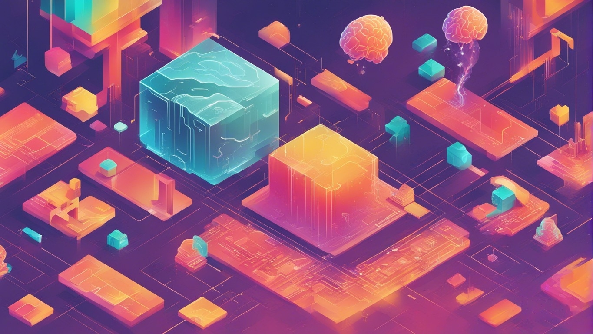
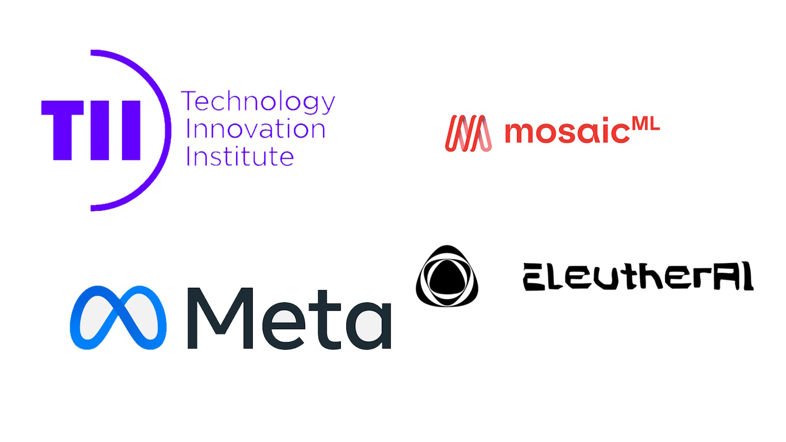
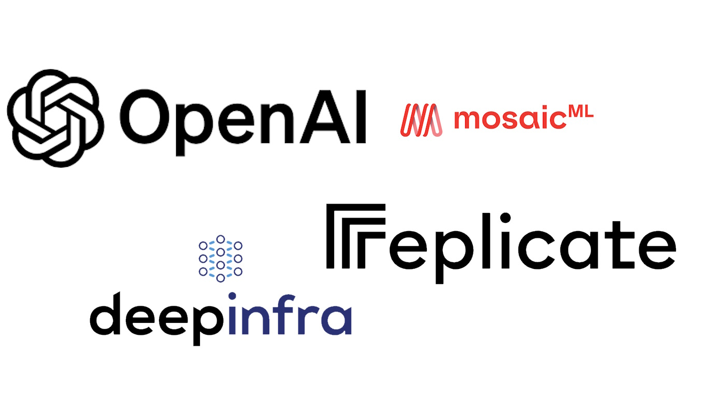
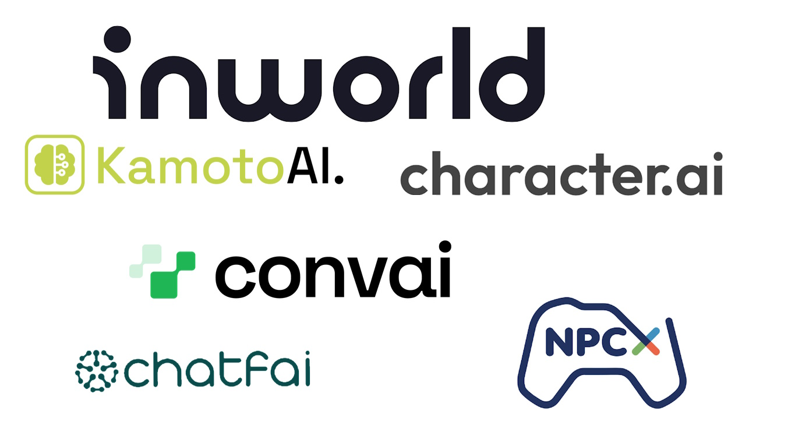

# LLM Modding 301

  

## Selecting Your Model or Service

When it comes to selecting your model or service, we have multiple options nowadays. Moreover, after the completion of this document, more options will likely appear, so I suggest using this list as a snapshot of today rather than a fully up-to-date list. If you are unsure about what service or online models are, please visit [LLM Modding 201](https://bloctheworker.github.io/llm-modding-guide/201) to get a gist of it.

## Possible Choices as of October 2023

## Local Models

  

There are A LOT of local models, mostly derived from base models with fine-tuning. Here, I will list the primary base models:

* **Falcon:**
Falcon is a series of generative large language models (LLMs) developed by the Technology Innovation Institute (TII) in Abu Dhabi. Falcon models use multiquery attention and a custom data pipeline to achieve high performance and scalability. Falcon models can generate text across various domains and tasks.

* **LLaMA:**
LLaMA is an acronym for Large Language Model Meta AI, a series of foundational large language models (LLMs) released by Meta (formerly Facebook). LLaMA models are trained on a large set of unlabeled data from 20 languages with Latin and Cyrillic alphabets. LLaMA models use rotary position embeddings and parallel computation to improve efficiency and versatility. LLaMA 2 became open-source quite recently.

* **MPT:**
MPT is an acronym for MosaicML Pretrained Transformer, a series of large language models (LLMs) developed by MosaicML, a platform for building and deploying machine learning models. MPT models use a modified transformer architecture with ALiBi (Attention with Linear Biases) and FlashAttention to eliminate context length limits and optimize speed. MPT models are trained on a mix of text and code data and can be fine-tuned for various tasks.

* **GPT-J:**
GPT-J is an open-source large language model (LLM) developed by EleutherAI in 2021. It is a generative pre-trained transformer model designed to produce human-like text that continues from a prompt. It has 6 billion parameters and uses dense attention, rotary position embeddings, and parallel computation. It was trained on the Pile dataset, which contains text from various sources and domains.

* **GPT-Neo:**
An open-source replication of GPT-3 with 2.7 billion parameters that can generate text across various domains and tasks. GPT-Neo is an open-source large language model (LLM) developed by EleutherAI in 2021. It is a model parallel GPT-2 and GPT-3-style model that uses the mesh-tensorflow library. It can generate text across various domains and tasks, such as natural language understanding, natural language generation, and conversational AI. It has two versions: one with 1.3 billion parameters and another with 2.7 billion parameters. It uses local attention in every other layer with a window size of 256 tokens. It was trained on the Pile dataset, which contains text from 26 diverse sources, such as books, news, Wikipedia, and code.

Apart from these base models, Hugging Face hosts a plethora of open-source fine-tuned models for almost each of these base models. You can find them [here](https://huggingface.co/models?other=text-generation-inference&sort=trending).

## Online Models

  

I will only list online models that can be used via an API. This means Bard or Bing Chat won't be part of this list.

* **OpenAI:** OpenAI offers a variety of products and services, such as GPT-4, ChatGPT 3.5 Turbo, and other tools like DALL·E, a generative model that creates images from text descriptions, and OpenAI Whisper, which transcribes audio into text (great for STT transformation). The OpenAI API can be used for our LLM modding purposes, provided the user provides their credentials or API Key to communicate with the servers.

* **MosaicML:** MosaicML is a platform for building and deploying generative AI models on your data within your secure environment. MosaicML offers the MPT Foundation Series, a series of open-source, commercially-licensed LLMs that can be used out of the box or fine-tuned on your data. MosaicML Inference is a service that allows you to securely deploy LLMs for up to 15x cost savings, and MosaicML Training is a service that enables you to pretrain or finetune your own state-of-the-art models with a single command and orchestrate across multiple clouds.

* **DeepInfra:** DeepInfra is a serverless inference service that provides access to a variety of LLMs and embeddings models. You can use Llama 2, GPT-J, GPT-Neo, and Falcon models there as API endpoints.

* **Replicate:** Replicate is a platform that lets you run open-source machine learning models with a cloud API. Replicate has a community of machine learning enthusiasts who have shared thousands of models, including language models, video creation and editing models, super resolution models, image restoration models, image-to-text models, and text-to-image models. Replicate also offers Cog, an open-source tool that lets you package machine learning models in a standard, production-ready container. You can run Llama2, GPT-J, and Falcon in Replicate as well.

## Service Models

  

I will list only the service models that I know, whether by name or by experience, but this is by no means a full list. Feel free to make a pull request if you want to extend this list.

* **[Inworld AI](http://inworld.ai?utm_campaign=bloc-modding-guide)**:
Inworld AI is the leading Character Engine for AI NPCs. It empowers non-player characters (NPCs) in games and virtual worlds with intelligent dialogue, making them more intelligent and humanized, and increasing their ability to interact with users. When you use Inworld, out-of-the-box you get LLM character support, text-to-speech with multiple realistic voices, speech-to-text support for microphone transcribe conversation, emotions, and an action system (for making mods interactive). Inworld also offers all these for free in their free tier, which any user can use without even providing credit card information. The free tier gives 5,000 free API interactions per month, which is enough for any mod (based on my experience). They also offer unlimited in-studio interaction, allowing users to talk or adjust certain things on their portal without paying anything extra. They have multiple SDKs for certain game engines, which may not be super helpful for modders, but they also have a Node.js SDK and direct endpoint calls that can be utilized easily. They also provide lipsync data if your game supports it. Not only that, but they also have seamless elevenlabs support for the voices, in case you have high-quality voices on elevenlabs, they can be used easily.

* **[ChatFAI](https://chatfai.com/)**:
ChatFAI is an AI-powered chatbot platform that allows users to engage in conversations with their favorite characters from movies, TV shows, books, and more. It uses natural language processing algorithms to generate responses to user input. They support custom character generation. They also have a free plan; however, their free plan is not usable for actual mod usage (as of September 2023) because it provides only 250 messages per month, which is quite limited.

* **[character.ai](character.ai)**:
character.ai is a company that brings to life the science-fiction dream of open-ended conversations and collaborations with computers. It is a chatbot web application with a neural language model that can produce text responses that sound like those of real people and engage in natural conversation. It can be used for imagination, brainstorming, and language learning. It is technically free upon sign-up and doesn't seem to have a message limit. They provide the c.ai+ model, which offers faster response times and priority access (because some characters require a waiting room if they are too high in demand). Unfortunately, they don't provide an official API, and you need to use an open-source unofficial version, which can break at any time, making it less suitable for long-term support mods. They don't have any TTS/SST system.

* **[convai](https://www.convai.com/)**:
Convai is really similar to Inworld AI; however, they don't seem to have the same features as Inworld does. Currently, they offer a free tier as well, but the limit might not be enough for everyone, as it's a per-day 100 interaction quota. Each message is considered one interaction. This can limit certain usages for many mods. They also provide SST/TTS like Inworld, and convai seems to have better voice quality overall. They also provide certain plugins to game engines like Inworld, and they provide a direct character creation endpoint as well (which is a pending feature on Inworld). They are currently partnered with Nvidia, which is important to note.

* **[Kamoto.AI](https://www.kamoto.ai/)**:
Kamoto.AI empowers celebrities, influencers, and users to create, train, and monetize bespoke AI Characters. Unfortunately, they don't seem to be providing any API, so you probably need to write your own unofficial package, which is often a ton of work.

* **[NPCx](https://npcx.ai/)**:
NPCx is a global team of computer engineers, data scientists, artists, and animators using next-generation Artificial Intelligence (AI) technology to support the digital storytellers of our time. They focus on Non-Player Characters (NPCs) in video games and aim to provide richer, more diverse, and lifelike 3D experiences at a fraction of the time and cost. Not much information is available aside from this. They don't have public sign-up and require you to contact them. Not exactly usable in this instance as of September 2023 but looks promising.

## Why Inworld Makes Sense?

Based on my experience as a mod owner, I can confidently say that many people lack the time or inclination to read through lengthy installation steps. Many ignore the entire description and attempt to install the mod directly. In such a situation, the last thing you want is to add a lot of complicated installation steps that users might not complete or realize after completion that their hardware isn't powerful enough. More steps == more bugs, which means more work for the mod owner. Considering that I'm not willing to pay high cloud computing fees, local models are not an option for me. The next choice is online models, but these require pretraining the models for better responses. They are often designed for developers, making the sign-up/setup process unattractive for average players. Given these conditions, service models become the most logical choice.

From the list, Inworld stands out with its free tier and feature pairing. I must admit that I'm biased here, as I have used Inworld in many of my mods, and they have given me a free developer account for several months. However, my mods have been downloaded and played by thousands of people, and I know for sure that most of them have enjoyed it completely free, without having to add their credit card details anywhere. Knowing that Inworld allows this flexibility to players is one of the main reasons why I choose to move forward with Inworld. In the next chapter, we will talk about details on using Inworld.
