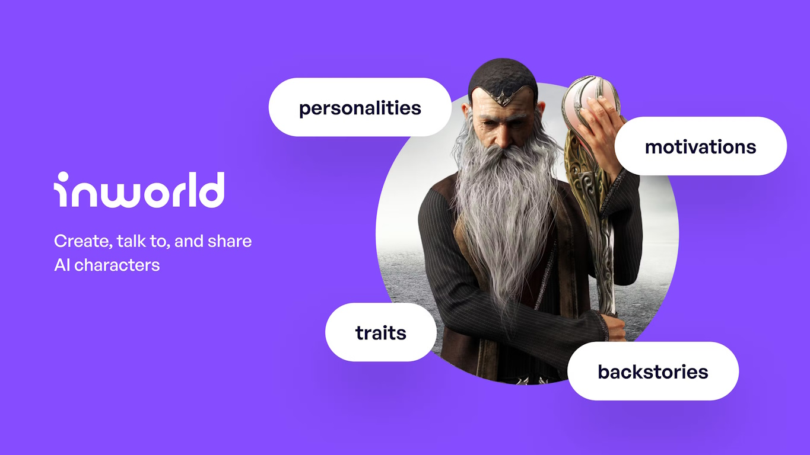
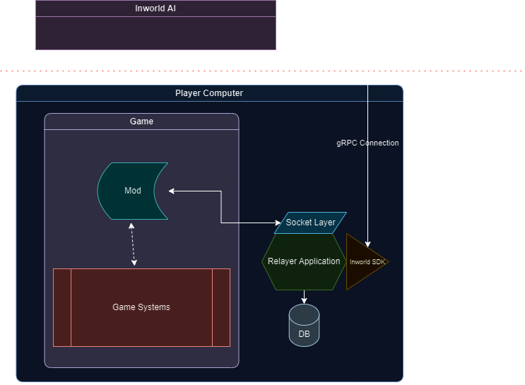

# LLM Modding 401

  

#### Why Inworld?
In case you want to know why this section is moving forward with Inworld AI, please have a look at the [301 section](https://bloctheworker.github.io/llm-modding-guide/301) to see the comparison between services and possible approaches. When all the pros and cons are laid out, I believe Inworld emerges as the best option, and this is the reason why I have used Inworld in almost all of my production mods.

## Understanding Inworld

At first glance, you might ask yourself, "How can I use this in my mod while Inworld's primary target audience seems to be game developers?" And you would be right to think like that. Technically, Inworld's main aim seems to be a one-dev subscription that all users can use without seeing Inworld at all. However, as you can guess, this is economically not viable for any mod creator unless you charge your users, which turns mods into more of a subscription-based DLC than a mod. I won't go into the pricing details of Inworld in this section since they are always gathering feedback from the customers and updating their pricing accordingly. Hence, there is a high chance that at the time of you reading this, Inworld AI's pricing can be even more affordable than the current system. But overall, Inworld's pricing policy is user-friendly enough that you can let users create an account and use it for a considerable amount of time for completely free.

Below, I will list pros and cons. However, this won't be a rehashing of the previous 301 section; rather, I will solely focus on DevEx here.

### Pros

**One Service to Rule Them All approach:** Provides nearly all the required tools in their featureset, so you don't need to sign up for different services one by one.

**Non-Alienating UX/UI:** Even though they mainly focus on Developers/Game Developers, their UI/UX encourages regular users to play around and get familiar with the system. This is not a direct benefit to you as a mod developer, but indirectly, it helps a lot because it removes a lot of "how can I do this and that" questions.

**Pricing:** It might not be fully free, but it's definitely *free* enough to develop and serve to players. It's also very easy for players to upgrade their account for more interaction time without needing any change from the mod developer.

**Engagement:** In case you have any questions, in their Discord channel, devs are actually engaging with you. This is extra good for those who are new to LLM modding. They help people from LLM prompting guides to technical stuff.

### Cons

**Protocol and SDKs:** The selected protocol (gRPC) isn't a great fit for mods that are already somewhat limited in terms of their tech-stack. Also, the SDKs are mainly focused on popular game engines such as Unreal or Unity, but 95% of the mods don't have direct interaction with these engines, even if the game is made with those engines.

**Missing APIs:** Unfortunately, Inworld is missing some very important APIs, such as creating, updating, or deleting characters/brains via API or SDK call. However, I know Inworld is aware of that, and they have already started to work on this, so by the time you are reading this, very likely this won't be an issue anymore.

 

  

## Getting Started with Inworld

Thanks to their pricing scheme and login system, testing out Inworld is super easy. Just head to [inworld.ai](http://inworld.ai?utm_campaign=bloc-modding-guide) and create your account by clicking on "Get Started." From there, Inworld will provide you with a workspace that includes certain characters as demo characters.

I would strongly suggest interacting with them first to get a feel for the entire experience. Once you feel like you've had enough interaction, check out their descriptions, goals, and more. Unlike other models, Inworld doesn't expect you to compose a big descriptive paragraph meticulously crafted over days. Instead, they separate the concerns and points into different sections so you can fill them out in a more organized manner. Moreover, Inworld does an excellent job with their character creation UI by distinguishing basic and advanced concepts. For example, the core description is a basic feature that all characters need to have, whereas personality and emotions are more advanced features than a basic character needs.

To provide a bit of information about each section briefly:

- Core Description: This is the basic structure of your character, including their history, current situation, and personality traits. This description is crucial and is taken very seriously by the LLM. It's wise not to include temporary information in this section because, in a way, this description is etched into the soul of the character.

- Flaws: These represent the character's weaknesses and vulnerabilities, along with motivations. These can be used to deepen the character you are creating.

- Dialogue Style: Inworld provides a bunch of very useful options if you don't want to handcraft every character's dialogue. However, if you want to get serious, you should add a custom dialogue style. Based on my observations, it consistently yields the best responses.

- Voice Parameters: This is probably the most understandable section. One thing to note is that it comes with out-of-the-box Elevenlabs integration. This means that if you want (or if the player wants), they can clone or use whatever Elevenlabs voice they have and integrate it here. When voice data is passed through, it will use Elevenlabs in this case.

Moving on to the advanced features: Personality, Knowledge, Goals, Scenes, and Relationships.

- Personality: As the name suggests, this section is related to the personality of our characters. Here, you can make the character sound more negative, joyful, feared, and so on. The emotional engine within Inworld is controlled by Personality, shaping how a character behaves by defining the range of their emotions using adjectives and sliders.

- Knowledge: Answers to user inquiries are provided by Facts and Knowledge. Character-specific information falls under Personal Knowledge, while Common Knowledge is shared across multiple characters, aiding in world creation. They are important if your characters are not based in the real world. You still cannot fully "isolate" the AI by adding a lot of common knowledge, but the more information you put, the better adapted answers you will get.

- Goals: This feature is exceptionally powerful, enabling the triggering of specific actions using predefined words or intents. I highly recommend exploring their documentation for more details.

- Scenes: I haven't fully grasped its potential and haven't utilized it much. Essentially, it provides characters with a sense of their current location. Since my modifications mostly focused on dynamic settings, Scenes didn't prove very useful for me. However, if you're concentrating on static scenes, it's worth delving into.

- Relationships: Relationship is a new feature set to allow for the development of relationships between NPCs and players across different gaming sessions. Basically, it means "progressive" relationship between player and character.

For more details, you can [check out their documentation](https://docs.inworld.ai/docs/intro).

### Architecture

!!! Tip "Note"
    If your game modding supports proper NDK integration, and if you are experienced in NDK development, please check out the Inworld NDK development kit. It could be 10x more efficient than the architecture described here. See [inworld-ai/inworld-ndk](https://github.com/inworld-ai/inworld-ndk).

Usually, games do not allow running different DLLs in their environment unless you know what you are doing and mod the core of the game all the way down. This is why it's often better to use a sidecar approach.

If you have played with my mods before, you probably noticed that it always requires you to see a "terminal" pop up in the background before starting the game. The main reason for that is that this "terminal" is basically a packaged Node.js socket server utilizing the existing Inworld SDK. Of course, depending on your implementation and requirements, you can completely remove this requirement and integrate the mod directly into the game itself.

I believe the image above explains the architecture clearly. However, to give a little more context:
The game never interacts with the Inworld AI system directly; it uses the "Relayer Application" as a proxy to perform its actions. In the diagram, the Relayer Application is shown to be using a socket layer; however, depending on restrictions in your mod, it can also be just a simple REST API.
As long as your sidecar is able to integrate the Inworld SDK, the rest is totally up to you. Technically, you can use named pipes to establish a connection between the application and the game. Or you can even use some custom format or makeshift solutions like writing to a file and reading from it on the application side. However, this should be the last resort since I/O operations are horribly slow and can cause unwanted lag in communication.

Another good aspect of the sidecar approach is that since it technically works like a separate process/application, it can work independently from the mod and can do more things. For example, if the game isn't allowing you to play sounds, you can handle this in the sidecar since it most likely will have a better chance of performing such operations. Moreover, you can also create your own small-scale database to store communication between the player and the system so that you may want to refer to that, keep some data for mod usage, and so on. The rest is really up to your imagination—go wild! :)

Here are some Inworld-powered mods and their accompanying source code, in case you’re interested:

**Official Inworld NodeJS SDK Examples** for both JS and TS. This should be your main entry point if you are not familiar with Inworld at all. [Link](https://github.com/inworld-ai/inworld-nodejs-sdk/tree/main/examples)

**Bannerlord Mod** using C# for the main Bannerlord mod + using a JS sidecar with a websocket layer and the Inworld NodeJS SDK. [Link](https://github.com/BlocTheWorker/Inworld-Bannerlord-Mod)

**Skyrim Mod** using C++ for the main Skyrim mod, Papyrus Scripting for game-related modding, C# Audio system for playing the sounds (because I didn't want to do this on the Skyrim or Node.js side) + using the TypeScript version of the sidecar that's using a websocket layer and the Inworld NodeJS SDK. [Link](https://github.com/BlocTheWorker/Inworld-Skyrim-Mod)

The **Inworld Discord** channel provides a great way to engage with other developers. You can ask your questions and gather some community know-how. You don't need to reinvent the wheel. [Link](https://discord.com/invite/2jGPwV8g3b)

## Remarks

Inworld AI is a fantastic service, and thus far, I've had a lot of fun working with it. As we outlined in the previous 301 section and here, it comes with its pros and cons, but I would confidently say that the pros overwhelmingly outweigh the cons. Moreover, you can always suggest improvements to Inworld. That's one of the great aspects I appreciate about them—how accessible they are. When you have a suggestion to enhance the system, you can simply propose it, and they actually listen! Although, like any company, they have their own backlog items and need to evaluate how to implement them. But taking a pragmatic viewpoint, every valuable feature they add will benefit them in the long run. Therefore, they have practically no reason to turn down good suggestions. So, you can always rest assured that someone will work on it if it's deemed good enough for their backlog.

This entire page is dedicated to how you can create your own mod using LLMs. However, you can apply the same ideas and architecture to your own games as well. Of course, the systems might technically be different than what's detailed in this document, especially since non-proprietary game engines offer more flexibility than proprietary ones, where most modding usually occurs.

That's a wrap, folks! I hope this document has been helpful to some of you. I'm aware that there might be many other services and models that I didn't mention, which you might also find appealing. However, this entire write-up was based on my knowledge and experiences. If you'd like to contribute or have any suggestions, feel free to do so by creating a pull request. If you found this article valuable and if you are from another language, please help me to translate this to your language.
