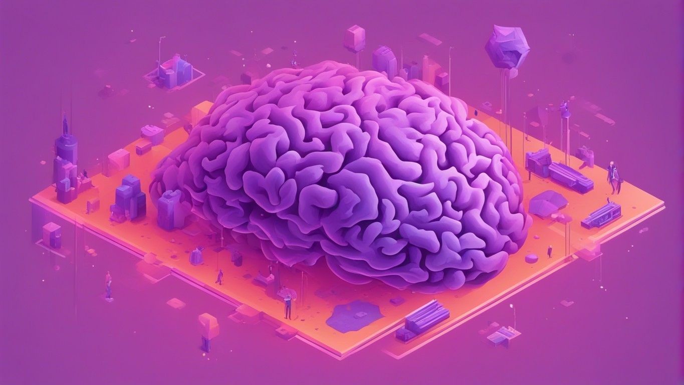
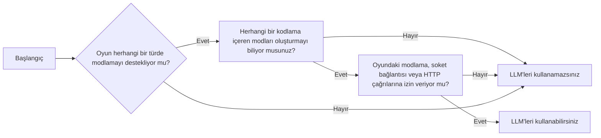

# LLM Modlama 101

  
  

 
## Giriş

Bu bölümde, LLM ile modlama temellerinden bahsedeceğim. Bazı kısımlar çok açık olabilir, ancak bu daha genel bir rehber olduğu için, aklıma gelen hemen hemen her şeyi belirtmeliyim diye düşünüyorum. "Ee herhalde" kısımları için okumayı atlayabilir ve devam edebilirsiniz.

LLM ile modlama, oyunlarınıza daha gerçekçi konuşmalar ve unutulmaz anılar eklemenin mükemmel bir yoludur. LLM'ler, diyaloglar, açıklamalar ve hatta tüm hikayeler oluşturmak için kullanılabilir. Ayrıca yeni karakterler, konumlar ve görevler oluşturmak için de kullanılabilirler.

İşte LLM'lerle modlamayı kullanmanın bazı avantajları:

- LLM'ler, geleneksel betikleme yöntemlerinden daha gerçekçi ve etkileyici diyaloglar oluşturabilir.
- LLM'ler, oyuncuların seveceği karmaşık ve unutulmaz karakterler yaratabilir.
- LLM'ler, oyununuza yeni içerikler, hikayeler, görevler ve konumlar oluşturmak için kullanılabilir.
- LLM'ler, oyununuzun yazılı içeriğinin genel kalitesini artırmak için kullanılabilir.

## Bazı Bilgiler

### LLM Nedir?
LLM, yani başka bir deyişle, Büyük Dil Modelleri, büyük bir metin ve kod veri setinde eğitilmiş modellerdir.

### GPT Nedir?
GPT, Generative Pre-trained Transformer'ın kısaltmasıdır. GPT, bir LLM türüdür. GPT, metin oluşturmak, dilleri çevirmek, farklı türlerde yaratıcı içerik yazmak ve bilgilendirici bir şekilde sorularınıza yanıt vermek için kullanılabilir.

### GPT Neden Bu Kadar Çok Dikkat Çekiyor?
GPT, şimdiye kadar yaratılan en güçlü ve çok yönlü dil modellerinden biri olduğu için bu kadar çok dikkat çekmektedir. Gerçekçi ve etkileyici diyaloglar oluşturmak, karmaşık ve unutulmaz karakterler oluşturmak ve oyunlar için yeni içerikler yazmak dahil olmak üzere çeşitli görevler için kullanılabilir.

### GPT, LLM'ler Yerine mi Kullanılıyor?
GPT, bir LLM türü olduğu için, LLM'ler yerine kullanılmaz. Ancak, GPT genellikle diğer LLM'lerden daha fazla tercih edilir çünkü OpenAI'nin (GPT 3.5+) kamuya açık bir API'si aracılığıyla kullanılması çok kolaydır.

### Bu Rehber Neden Çoğunlukla LLM'lere Odaklanıyor?
Bu rehber çoğunlukla LLM'lere odaklanıyor çünkü LLM modlaması günümüzde oldukça yeni bir konu ve modladığınız oyun ne olursa olsun takip etmeniz gereken bazı ortak ana noktaları paylaşıyor.

### GPT veya Herhangi Bir LLM Kullanmadan Sinir Ağlarını Nasıl Kullanabilirim?
GPT veya herhangi bir LLM kullanmadan sinir ağlarını kullanmanın birçok yolu vardır. Örneğin, sinir ağlarını resimleri sınıflandırmak, müzik oluşturmak veya dilleri çevirmek için kullanabilirsiniz.
Bir sinir ağı kullanmak için, onu bir veri seti üzerinde eğitmeniz gerekecektir. Resimleri sınıflandırmak için bir sinir ağı kullanmak istiyorsanız, onu bir resim veri setinde eğitmeniz gerekecektir. Sinir ağı eğitildikten sonra, onu yeni veriler üzerinde tahminler yapmak için kullanabilirsiniz. Örneğin, bir sinir ağı resimleri sınıflandırmak için eğittiyse, daha önce hiç görmediğiniz yeni resimleri sınıflandırmak için onu kullanabilirsiniz.

### Karakter Motoru Nedir?
Karakter motorları, geliştiricilere yapay zeka destekli NPC'ler oluşturmak için gereken zamanı, çabayı ve kaynakları büyük ölçüde azaltmalarına yardımcı olur. Temelde, generatif yapay zeka karakter oluşturma için bir oyun motoru gibi işlev görür.

### LLM'lerin En Büyük Zorlukları
LLM'ler, birkaç önemli zorlukla karşılaşır, bunlar:

* **Önyargı:** LLM'ler, üzerinde eğitildikleri verilerde bulunan önyargıları yansıtabilir.
* **Güvenlik:** LLM'ler, nefret söylemi veya yanıltıcı bilgiler gibi zararlı içerikler oluşturmak için kullanılabilir.
* **Maliyet:** LLM'leri eğitmek ve konuşlandırmak pahalı olabilir.

### Veri ve Bilgi Nedeniyle Kendi Sinir Ağınızı Eğitmenin Zor Olması

Kendi sinir ağınızı eğitmenin zor olmasının nedeni, veri ve bilgi gereksinimleridir. Sinir ağları, büyük miktarda veri üzerinde eğitilmelidir ve etkili eğitim için yeterli veri toplamak zor ve pahalı olabilir.

Ayrıca, kendi sinir ağınızı başarıyla eğitmek için makine öğrenmesi ve sinir ağları hakkında bilgi gereklidir. Bu bilgiye sahip değilseniz, bir sinir ağı eğitmek zorlu bir görev olabilir.

## LLMleri Kullanabilir Miyim?

LLM ile modlama, her oyun için doğru olmayabilir. LLM ile oyununuzu modlamaya karar vermeden önce dikkate almanız gereken birkaç şey şunlardır:

* **Oyununuz modlanabilir mi?** Tüm oyunlar modlanabilir değildir. Bazı oyunlarda mod desteği yerleşik olarak bulunurken, diğerleri üçüncü taraf araçları gerektirir. Oyununuz modlanabilir değilse, onu LLM ile modlamak için kullanamazsınız.
* **Oyununuzun bir modlama topluluğu var mı?** Tüm oyunların bir modlama topluluğu yoktur ve hatta varsa bile, topluluk aktif veya destekleyici olmayabilir. Oyununuz için bir modlama topluluğu yoksa, sorunlarla karşılaştığınızda yardım ve desteği bulmak daha zor olacaktır. Özellikle o oyun için deneyimli bir modder değilseniz.
* **Hedefleriniz neler?** Oyununuzu LLM ile modlayarak neyi başarmayı umuyorsunuz? Diyalogları iyileştirmek, yeni karakterler eklemek veya yeni içerik oluşturmak mı istiyorsunuz? Hedeflerinizi bildiğinizde, onları gerçekleştirmek için LLM'yi en iyi şekilde nasıl kullanabileceğinizi düşünmeye başlayabilirsiniz.

## Başlamadan Emin Olun
Oyununuzu LLM ile modlamaya başlamadan önce, gerekli tüm araç ve kaynaklara sahip olduğunuzdan emin olmak önemlidir. Kontrol etmeniz gereken birkaç şey şunlar:

* **En son LLM sürümüne sahip olduğunuzdan emin olun.** LLM sürekli olarak güncellenmektedir, bu yüzden en son sürüme sahip olduğunuzdan emin olmanız önemlidir. Eğer çevrimiçi modelleri kullanıyorsanız, bu genellikle sizin kontrolünüzde olmaz - ki bu, hedefinize bağlı olarak iyi veya kötü olabilir.
* **LLM'yi nasıl kullanacağınızı iyi bir şekilde anladığınızdan emin olun.** Çevrimiçi olarak kullanabileceğiniz birçok öğretici ve kaynak vardır ki bu, LLM'yi nasıl kullanacağınızı öğrenmenize yardımcı olabilir. Kendi sunucunuzu bazı LLM sürümü (Llama vb.) ile oluşturuyorsanız, bunun nasıl çalıştığını bilmeli ve API'nizi buna göre ayarlamalısınız. Her iki durumda da belli bir uzmanlık gereklidir.
* **Oyununuz için modlama araçlarını iyi bir şekilde anladığınızdan emin olun.** Her oyunun kendi modlama araçları ve süreçleri vardır, bu yüzden onları nasıl kullanacağınızı anlamanız önemlidir. Eğer bunu nasıl kullanacağınızı bilmiyorsanız, ilk hedefinizin bunu kontrol etmek ve öğrenmek olması gerektiğidir. Hatta oyun X'te deneyimli bir modder bile olsanız, bu, oyun Y'de de harika olacağınızı garanti etmez.

## Temeller

LLM modlamaya başlamak için, birkaç temel şeyi bilmelisiniz:

* **İstek becerileri:** LLM, büyük bir metin ve kod veri setinde eğitilmiştir, ancak yine de metin oluşturmak için istekte bulunması gerekmektedir. En iyi sonuçları elde etmek için etkili istekler yazmayı öğrenmeniz gerekecektir. Bu gerekliliği belirli hizmetler için (Örneğin Inworld) ortadan kaldırabilirsiniz ancak kendi sistemlerinizi kullanmayı planlıyorsanız, bu bir zorunluluktur.
* **Kodlama becerileri:** Bazı LLM modlamaları, bazı kodlama becerilerini gerektirecektir. Örneğin, LLM'yi oyununuza entegre etmek veya özel istekler oluşturmak için kod yazmanız gerekebilir.

LLM ve kodlama hakkında temel bir anlayışa sahip olduğunuzda, oyununuzu modlamayı denemeye başlayabilirsiniz. Oyununuzu modlamak için LLM'yi kullanmanın birçok yolu vardır, bu yüzden yaratıcı olun ve eğlenin!

İşte LLM modlaması için bazı ek ipuçları:

* **Küçükten başlayın.** Tüm oyununuzu bir anda modlamayı denemeyin. Oyununuzun küçük bir kısmını, örneğin tek bir karakteri veya görevi modlamaya başlayın. Bu, ipuçlarını öğrenmenize ve olası herhangi bir sorunu belirlemenize yardımcı olacaktır.
* **Sık sık test edin.** Oyununuza bazı değişiklikler yaptıktan sonra, onları iyice test ettiğinizden emin olun. Bu, oluşturmuş olabileceğiniz herhangi bir hatayı veya sorunu belirlemenize yardımcı olacaktır.
* **Başkalarından geri bildirim alın.** Değişikliklerinizi test ettikten sonra, onları başkalarıyla paylaşın ve geri bildirim alın. Bu, modunuzun nerede geliştirilebileceğini belirlemenize yardımcı olacaktır.

LLM modlaması çok eğlenceli olabilir ve oyunlarınızı geliştirmenin harika bir yoludur. Biraz çaba ile, oyunlarınızı kendiniz ve diğerleri için daha keyifli hale getirecek modlar oluşturabilirsiniz.