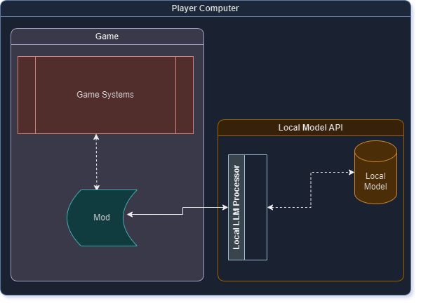
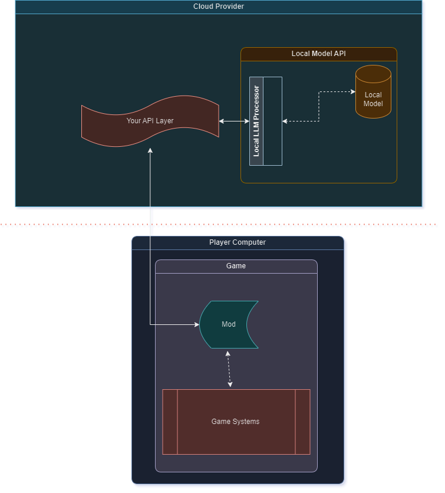
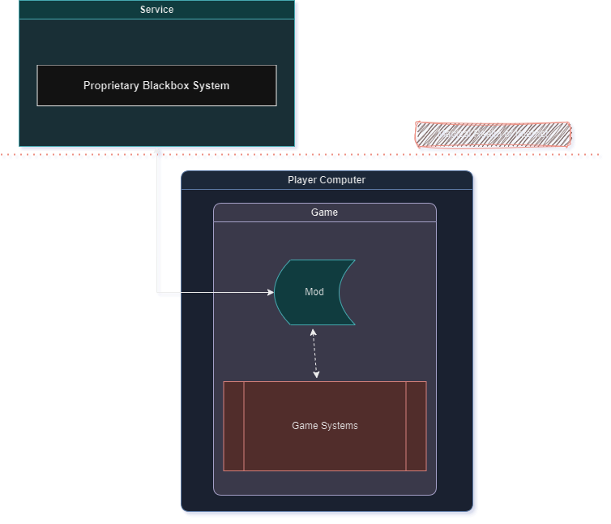

# LLM Modlama 201

  
  

## Yerel, Çevrimiçi veya Hizmet Modelleri?

LLM'lerle modlama söz konusu olduğunda birden çok seçeneğiniz var. Bu sınıflandırma bazıları için tatmin edici olmayabilir, ancak ben bunları böyle sınıflandırmak istiyorum ve işte her biri hakkında bazı detaylar:

* Yerel LLM Modelleri: İnternete bağlantı gerektirmeyen ve tüm hesaplamaların tüketici çalışma zamanında gerçekleştiği, tüketici sınıfı PC'lerde çalışan modellerdir.
* Çevrimiçi LLM Modelleri: Donanım sınırlamaları veya yasal sınırlamalar nedeniyle bunları tüketici donanımında çalıştıramadığınız modellerdir ve bunları çevrimiçi olarak çalıştırmanız gerekmektedir.
* Hizmet LLM Modelleri: Belirli alanlarda uzmanlaşmış ve geliştiricilerin kullanabilmesi için bir API sunan modellerdir. Bu, LLM sistemlerinin bazı zahmetli yönlerini denklemden çıkarır (Örnek: Inworld AI).

Bunların karışımı olan bazı modeller bulmuş olabilirsiniz, ancak bunlar için ayrı bir kategori oluşturmaya gerek yok. Aşağıdaki bölümde, her bir kategori modelini bildiğim kadarıyla ayrıntılı olarak açıklamaya çalışacağım ve her birinin artılarını ve eksilerini belirteceğim.

## Yerel Modeller Hakkında

#### Temel Mimari Dizaynı

**Artıları:**

Yerel modeller genellikle sürekli bir internet bağlantısı gerektirmezler. Bu, gizlilik konusunda endişeli olan kullanıcılar için faydalıdır. Ayrıca, modellerin çoğu herhangi bir kısıtlama olmadan çalıştırılabilir, bu da daha az sansürlü modellerin modlarda çalıştırılmasına izin verir - bu, aklınızda bulunan mod konseptinin türüne bağlı olarak harika olabilir (örneğin, birçok AI modeli, bazı koruma raylarını çıkarmadıkça şiddeti onaylamaz). Ayrıca ücretsizdirler, çünkü her şey yerel olarak gerçekleşir, bu yüzden kullanıcıların bir şey ödemesi gerekmez.

**Eksileri:**

Genellikle yerel modeller iki kalitede gelir - büyük parametreli modeller ve küçük parametreli modeller. Büyük parametreli modeller genellikle çalıştırmak için çok yüksek seviye donanıma ihtiyaç duyar (en azından 100sGB RAM ve benzeri) ve donanımda çok büyük bir depolama alanı kaplar. Bu, beklendiği gibi, şu anki mod kullanıcılarının her birine cazip gelmeyebilir ve yalnızca oyuncu tabanının bir kısmını mod kullanıcıları olarak hedef alırsınız. Küçük parametreli modeller için ise, çoğu durumda daha az güçlü makineler gerektirirler. Ancak, hala yaklaşık 16GB RAM, iyi bir GPU ve oldukça büyük depolama alanı gerektirirler. Ne yazık ki, bu küçük parametreli modellerin cevaplarının kalitesi de çok tartışmalıdır (en azından benim gözlemlediğim kadarıyla, iyi değiller). GPT-Q ve GGML model versiyonlarını bulabilirsiniz, bu da tüketici özelliklerine bağlı olarak yardımcı olabilir, ancak yine de her kategoride iyi seviye donanıma ihtiyacınız vardır. GPT-Q, CUDA çıkarım modelleri için (temelde GPU) ve GGML, CPU için tasarlanmıştır. Ayrıca, tüketici donanımında çalışabilen modeller vardır, burada 4GB VRAM veya 16GB RAM gerektirir ve "Harika, yani çalışıyor" diyebilirsiniz, ancak modelleri çalıştırmanın tek gereklilik olmadığını unutabilirsiniz. Modelleri ve oyunu aynı anda çalıştırmamız gerekiyor ve bu, oyun performansını etkilemeksizin (sınırlı RAM/VRAM nedeniyle) bunu yapmak yüksek seviye donanım gerektirir, ki çoğu kişi bunlara sahip değildir. Ayrıca, bu yerel modelleri kurmak genellikle oyuncunun donanımına çok fazla yardımcı yazılım yüklemeyi gerektirir, bu da onların modlarından keyif almadan önce tamamlamaları gereken adımları artırır. Mod kullanıcılarının çoğu yazılım geliştirici olmadığından, sizin gibi ortamlarını kurmakta zorlanacaklar, bu da modunuzdan keyif alabilecek oyuncu sayısını azaltacaktır. Ayrıca, tüm yerel modeller, Çevrimiçi veya Hizmet modellerinin sunduğu yan faydaları eksik eder, örneğin TTS/STT veya eylem sistemleri, sesler vb. En iyi yanıtları almak için modunuzun yerel modeli bu yapıda çağırmasına izin veren LLM uyandırma öğrenmeniz gerekiyor.

## Çevrimiçi Modeller Hakkında

#### Temel Mimari Dizaynı

**Artıları:**

Çevrimiçi modellerin iki alt kategorisi olabilir: kullanıma hazır çevrimiçi modeller, örneğin OpenAI'nin API'si, veya özel çevrimiçi modeller, örneğin yerel modellerinizi bulut sağlayıcınızda çalıştırma ve bu API'yi mod geliştiricilere açma. Bu seçeneklerin her ikisinin de ortak bir avantajı vardır: İcra yükünü tüketici donanımından alırlar. Bu, PC özelliklerinden bağımsız olarak, modu oynayabildikleri sürece LLM'leri de kullanabilecekleri anlamına gelir. Ayrıca, genellikle kullanıcıların kurulumu daha kolaydır çünkü mod oluşturucu olarak sadece API'yi çağırırsınız ve onların ekstra bir şey yapmalarına gerek kalmaz. Güncelleme bakımından da, daha iyi bir sürüm çıktığında GB'larca veriyi güncelleme olarak itmek zorunda kalmazsınız; sadece sunucuda güncelleyebilir veya kullanıma hazır bir model kullanıyorsanız, otomatik olarak güncellenir.

**Eksileri:**

Kullanıcıların bunu kullanabilmesi için internete bağlı olması gerekiyor - yani sürekli internet bağlantısı şart. Kullanıma hazır çevrimiçi modeller genellikle ücretsiz değildir ve abonelik gerektirir. Başka bir deyişle, kullanıcıların kullanım için ödeme yapması ve bir sayfaya kaydolması ve kullanıcı arayüzünde bazı ekstra işler yapması gerekiyor, ki bu birçok kullanıcı tarafından tercih edilmez çünkü bu bir ekstra adımdır. Özel çevrimiçi modeller için ise, siz (mod geliştirici olarak) çok güçlü bir donanıma sahip bir VM'yi bir bulut sağlayıcıdan kiralamanız ve yukarıda açıklanan tüm yerel model adımlarını izlemeniz gerekir. Ek olarak, gelen çağrıları işleyip onları yerel model işlemcinize yönlendirebilecek ve yanıtı çağrı yapan kişiye geri gönderebilecek kendi API arayüzünüzü yazmanız gerekir. Tahmin edebileceğiniz gibi, bu mod oluşturucular için ekonomik olarak uygulanabilir değildir, çünkü böyle bir sunucuyu çalıştırmak çok para mal olabilir. Artı, şimdi temelde performanslı bir web API yazmayı öğrenmeniz gerekiyor - ki bu daha çok işle ilgili bir beceriden ziyade bir hobi-modlama becerisidir. Ayrıca, en iyi yanıtları almak için modunuzun yerel modeli bu yapıda çağırmasına izin veren LLM uyandırma öğrenmeniz gerekiyor. Yerel modellere benzer şekilde, çevrimiçi modellerin çoğu TTS/SST ve duygular gibi ekstra özelliklerle gelmez.

## Hizmet Modelleri Hakkında

#### Temel Mimari Dizaynı

**Artıları:**

Hizmet modelleri genellikle konuşma amaçlı karakterler oluşturmak için özelleştirilmiştir, bu da bu hizmetleri kullanmak için az veya hiç uyandırma becerisine ihtiyaç duymadığınız anlamına gelir. Bu, basit görünse de, geliştiricilerin omuzlarından büyük bir iş yükünü kaldırır. Çevrimiçi modellere benzer şekilde, ayrıca kullanıcılar için zahmetli kurulum adımlarını da ortadan kaldırırlar çünkü kullanıcılar için yerel bir kurulum gerekmez. Genel mimari, geliştiriciler için sadece başka bir API çağrısı olduğu için daha basit olacaktır. Ayrıca, bu hizmetler profesyonel şirketler tarafından sürdürüldüğünden, kullanım durumunuza bağlı olarak kaba uygulama detaylarını soyutlayan kendi SDK'larına sahip olurlar. Ayrıca, hizmet modelleri, herkesin donanım gücünden bağımsız olarak LLM'leri kullanabilmesini sağlar, çünkü çevrimiçi modellere benzer şekilde, hizmet modelleri icra yükünü oyuncunun donanımından kaldırır. Tüm hizmet modelleri bunu sunmasa da, Inworld gibi hizmetler TTS/SST, Elevenlabs entegrasyonu, duygular, bellek ve daha fazlasını kutudan çıkar gibi sunar, LLM ile modun yeteneklerini önemli ölçüde zenginleştirir. Hizmet modellerinin doğası gereği, çevrimiçi modellere kıyasla daha maliyet bilincine sahiptirler, çünkü hedef kitleleri geliştiriciler değil, son kullanıcılardır. Hizmet modellerinin kayıt, ödeme ve kurulum süreçleri genellikle müşteri-öncelikli bir zihniyetle tasarlanmıştır, bu da kullanıcıların benzer UI/UX sayfaları nedeniyle kullanıcı kabulünü kolaylaştırır. Hizmet modelleri, kendi sunucularını kurmalarına veya altyapı için ödeme yapmalarına gerek olmadığı için mod geliştiricilerinden herhangi bir çaba gerektirmez, sadece hizmet uç noktalarını kullanır, bu da mod oluşturucuları için geliştirmeyi önemli ölçüde kolaylaştırır.

**Eksileri:**

Çevrimiçi modellere benzer şekilde, kullanıcıların hizmet modellerini kullanabilmesi için internete bağlı olması gerekiyor, ki bu bazı kullanıcılar tarafından tercih edilmez. Hizmet modelleri genellikle ücretli abonelik gerektirir, ancak Inworld gibi hizmetler çoğu kullanım durumu için Ücretsiz katmanlar sunar. Yine de, bu sistemler kayıt gerektirir, bu da kullanıcılar için ekstra bir adımdır.

