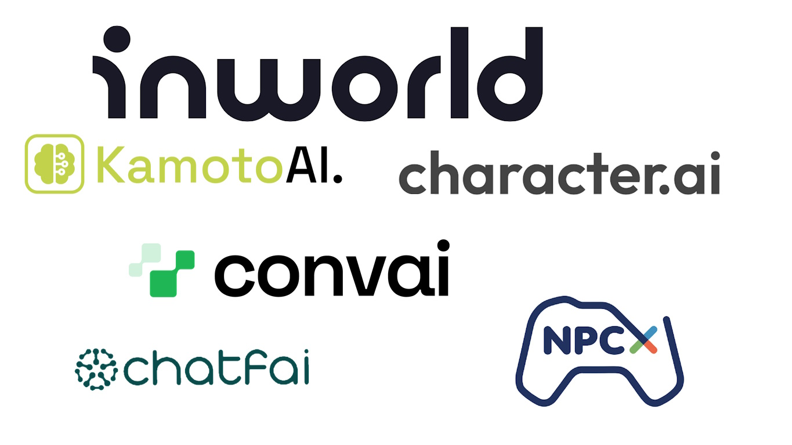

# LLM Modlama 301  
  

  
    

  
  
## Model veya Servis Seçimi  
  
Model veya servis seçiminde günümüzde birden çok seçeneğimiz bulunmaktadır. Ayrıca, bu belgenin tamamlanmasının ardından daha fazla seçenek ortaya çıkacaktır, bu yüzden bu listayı tamamen güncel bir liste yerine bugünün bir anlık görüntüsü olarak kullanmanızı öneririm. Hangi servisin veya çevrimiçi modelin ne olduğundan emin değilseniz, konuyu anlamak için lütfen [LLM Modlama 201](https://bloctheworker.github.io/llm-modding-guide/tr/201) sayfasını ziyaret edin.  
  

  
  
## Ekim 2023 İtibarıyla Olası Seçenekler  
  
## Yerel Modeller  

  

Bir SÜRÜ yerel model var, çoğunlukla temel modellerden türetilen ve ince ayar yapılmış modeller. Burada, temel modelleri listeleyeceğim:  
  
* **Falcon:**  
Falcon, Abu Dabi'deki Teknoloji İnovasyon Enstitüsü (TII) tarafından geliştirilen genişleyebilen büyük dil modelleri (LLM'ler) serisidir. Falcon modelleri, yüksek performans ve ölçeklenebilirlik sağlamak için çoklu sorgu dikkatini ve özel bir veri hattını kullanır. Falcon modelleri, çeşitli alanlarda ve görevlerde metin oluşturabilir.  
  
* **LLaMA:**  
LLaMA, Meta'nın (eski adıyla Facebook) yayınladığı temel büyük dil modelleri (LLM'ler) serisinin kısaltmasıdır. LLaMA modelleri, Latin ve Kiril alfabesi olan 20 dilden büyük bir etiketsiz veri setinde eğitilmiştir. LLaMA modelleri, döner pozisyon gömme ve paralel hesaplama kullanarak verimliliği ve çok yönlülüğü artırır. LLaMA 2, oldukça yakın bir zamanda açık kaynak hale geldi.  
  
* **MPT:**  
MPT, MosaicML tarafından geliştirilen büyük dil modelleri (LLM'ler) serisinin kısaltmasıdır. Makine öğrenme modelleri oluşturma ve dağıtma platformu olan MosaicML, MPT modellerini geliştirdi. MPT modelleri, ALiBi (Dikkatli Lineer Önyargılar) ve FlashAttention ile modifiye edilmiş bir transformer mimarisi kullanır. Bu sayede, bağlam uzunluk sınırlarını ortadan kaldırır ve hızı optimize eder. MPT modelleri, metin ve kod verilerinin karışımında eğitilmiştir ve çeşitli görevler için ince ayar yapılabilir.  
  
* **GPT-J:**  
GPT-J, 2021'de EleutherAI tarafından geliştirilen açık kaynaklı bir büyük dil modeli (LLM)dir. Bir isteğe devam eden insan gibi metin üretmek üzere tasarlanmış bir generatif ön eğitimli transformer modelidir. 6 milyar parametreye sahiptir ve yoğun dikkat, döner pozisyon gömme ve paralel hesaplama kullanır. Çeşitli kaynaklardan ve alanlardan metin içeren Pile veri setinde eğitilmiştir.  
  
* **GPT-Neo:**  
GPT-3'ün açık kaynaklı bir replikası olan ve çeşitli alanlarda ve görevlerde metin oluşturabilen 2.7 milyar parametreli bir modeldir. GPT-Neo, 2021'de EleutherAI tarafından geliştirilen açık kaynaklı bir büyük dil modeli (LLM)dir. GPT-2 ve GPT-3 tarzında bir model paralel modeli olan mesh-tensorflow kütüphanesini kullanır. Doğal dil anlama, doğal dil oluşturma ve konuşmacı AI gibi çeşitli alanlarda ve görevlerde metin oluşturabilir. İki versiyonu vardır: biri 1.3 milyar parametreli, diğeri 2.7 milyar parametreli. Her iki katmanda yerel dikkat kullanır ve pencere boyutu 256 belirtedir. Kitaplar, haberler, Wikipedia ve kod gibi 26 çeşitli kaynaktan metin içeren Pile veri setinde eğitilmiştir.  
  
Temel modellerin yanı sıra, Hugging Face, bu temel modellerin hemen hemen her biri için açık kaynaklı ince ayarlı modeller sunar. [Buradan](https://huggingface.co/models?other=text-generation-inference&sort=trending) bulabilirsiniz.  
  

  
  
## Çevrimiçi Modeller  

  

Yalnızca bir API üzerinden kullanılabilecek çevrimiçi modelleri listeleyeceğim. Bu, Bard veya Bing Chat'in bu listeye dahil olmayacağı anlamına gelir.  
  
* **OpenAI:** OpenAI, GPT-4, ChatGPT 3.5 Turbo ve DALL·E (metin açıklamalarından resimler oluşturan bir generatif model) ve OpenAI Whisper (sesi metne dönüştüren bir araç, STT dönüşümü için harika) gibi çeşitli ürünler ve hizmetler sunar. OpenAI API'si, kullanıcının sunucularla iletişim kurmak için kimlik bilgilerini veya API Anahtarını sağlaması şartıyla, LLM modlama amaçlarımız için kullanılabilir.  
  
* **MosaicML:** MosaicML, generatif AI modellerinizi güvenli bir ortamda oluşturmanızı ve konuşlandırmanızı sağlayan bir platformdur. MosaicML, kutudan çıkar çıkmaz kullanılabilecek veya verilerinizde ince ayar yapılabilecek açık kaynaklı, ticari lisanslı LLM'ler olan MPT Foundation Series'i sunar. MosaicML Inference, LLM'leri güvenli bir şekilde konuşlandırmanıza ve 15 kata kadar maliyet tasarrufu yapmanıza olanak sağlayan bir hizmettir ve MosaicML Training, tek bir komutla kendi son teknoloji modellerinizi önceden eğitmenize veya ince ayar yapmanıza ve birden çok bulut arasında düzenlemenize olanak sağlayan bir hizmettir.  
  
* **DeepInfra:** DeepInfra, çeşitli LLM'ler ve gömme modellere erişim sağlayan bir sunucusuz çıkarım hizmetidir. Llama 2, GPT-J, GPT-Neo ve Falcon modellerini API uç noktaları olarak kullanabilirsiniz.  
  
* **Replicate:** Replicate, açık kaynaklı makine öğrenme modellerini bir bulut API'si ile çalıştırmanıza olanak sağlayan bir platformdur. Replicate, dil modelleri, video oluşturma ve düzenleme modelleri, süper çözünürlük modelleri, görüntü restorasyon modelleri, görüntüden metne modeller ve metinden görüntüye modeller dahil binlerce modeli paylaşan bir makine öğrenme meraklıları topluluğuna sahiptir. Replicate ayrıca, makine öğrenme modellerini standart, üretim için hazır bir konteynere paketlemenizi sağlayan açık kaynaklı bir araç olan Cog'u sunar. Replicate'de Llama2, GPT-J ve Falcon'u da çalıştırabilirsiniz.  
  

  
  
## Servis Modelleri  

  

Sadece bildiğim veya tecrübe ettiğim servis modellerini listeleyeceğim, ancak bu kesinlikle tam bir liste değil. Bu listeyi genişletmek isterseniz, çekme isteği yapmaktan çekinmeyin.  
  
* **Inworld AI**:  
Inworld AI, AI NPC'ler için önde gelen Karakter Motorudur. Oyunlarda ve sanal dünyalarda oyuncu olmayan karakterlere (NPC'ler) zeki diyalog yeteneği kazandırır, onları daha zeki ve insana benzeyen hale getirir ve kullanıcılarla etkileşim yeteneklerini artırır. Inworld'u kullanırken, kutudan çıkar çıkmaz LLM karakter desteği, birden çok gerçekçi sesle metinden konuşmaya, mikrofonla sohbeti dönüştürme için konuşmadan metne desteği, duygular ve bir eylem sistemi (modların interaktif hale getirilmesi için) alırsınız. Inworld ayrıca bunların tümünü, kullanıcıların kredi kartı bilgilerini bile vermeden kullanabilecekleri ücretsiz bir katmanda sunar. Ücretsiz katman, ayda 5.000 ücretsiz API etkileşimi sağlar, bu da herhangi bir mod için yeterli olur (deneyimime dayanarak). Ayrıca, kullanıcıların portalda belirli şeyleri konuşmak veya ayarlamak için hiçbir ekstra ücret ödemeden sınırsız stüdyo etkileşimi sunarlar. Belirli oyun motorları için birçok SDK'ları vardır, bu modderlar için süper yardımcı olmayabilir, ancak ayrıca bir Node.js SDK'ları ve kolayca kullanılabilen doğrudan uç nokta çağrıları da sağlarlar. Oyununuz bunu destekliyorsa, dudak senkronizasyonu verileri de sağlarlar. Sadece bu değil, ayrıca sesler için sorunsuz elevenlabs desteği de var, yani eğer elevenlabs'ta yüksek kaliteli sesleriniz varsa, kolayca kullanılabilirler.  
  
* **ChatFAI**:  
ChatFAI, kullanıcıların filmlerden, TV şovlarından, kitaplardan ve daha fazlasından favori karakterleriyle konuşmalarına olanak sağlayan bir AI destekli sohbet botu platformudur. Kullanıcı girişine yanıt oluşturmak için doğal dil işleme algoritmalarını kullanır. Özel karakter oluşturmayı desteklerler. Ayrıca bir ücretsiz planları da var; ancak, ücretsiz planları, gerçek mod kullanımı için (Eylül 2023 itibarıyla) kullanılamaz çünkü ayda yalnızca 250 mesaj sağlar ki bu oldukça sınırlıdır.  
  
* **character.ai**:  
character.ai, bilim kurgu hayalini gerçeğe dönüştürüyor: bilgisayarlarla açık uçlu konuşmalar ve işbirlikleri. Bir sohbet botu web uygulamasıdır ve gerçek insanlarınkine benzeyen metin yanıtlarını üretebilen ve doğal bir konuşma içinde etkileşime girebilen bir neural dil modeline sahiptir. Hayal gücü, beyin fırtınası ve dil öğrenme için kullanılabilir. Teknik olarak kayıt olunduğunda ücretsizdir ve mesaj sınırlaması gibi görünmüyor. c.ai+ modelini sunarlar, bu model daha hızlı yanıt süreleri ve öncelikli erişim sunar (çünkü bazı karakterler çok talep gördüğünde bekleme odası gerektirir). Ne yazık ki, resmi bir API sağlamıyorlar ve açık kaynaklı resmi olmayan bir sürümü kullanmanız gerekiyor, bu da her an bozulabilir ve bu da uzun vadeli destek modları için daha az uygun hale getirir. Herhangi bir TTS/SST sistemi yoktur.  
  
* **convai**:  
Convai, Inworld AI'ye oldukça benzer; ancak, Inworld'un sunduğu özelliklere sahip gibi görünmüyor. Şu anda, bir ücretsiz katman da sunuyorlar, ancak sınır herkes için yeterli olmayabilir, çünkü günlük 100 etkileşim kotası var. Her mesaj bir etkileşim olarak kabul edilir. Bu, birçok mod için belirli kullanımları sınırlayabilir. Inworld gibi SST/TTS sunarlar ve genel olarak convai'nin ses kalitesi daha iyidir. Inworld gibi belirli oyun motorlarına belirli eklentiler sağlarlar ve doğrudan karakter oluşturma uç noktası da sağlarlar (Inworld'da bekleyen bir özellik). Şu anda Nvidia ile ortaklık yapmaktadırlar ki bu önemlidir.  
  
* **Kamoto.AI**:  
Kamoto.AI, ünlüleri, etkileyicileri ve kullanıcıları, özelleştirilmiş AI Karakterler oluşturmak, eğitmek ve gelir elde etmek için güçlendirir. Ne yazık ki, herhangi bir API sağlamıyor gibi görünüyorlar, bu yüzden muhtemelen kendi resmi olmayan paketinizi yazmanız gerekecek ki bu genellikle çok fazla iş gerektirir.  
  
* **NPCx**:  
NPCx, bilgisayar mühendisleri, veri bilimcileri, sanatçılar ve animatörlerden oluşan küresel bir ekip olan ve hikaye anlatıcılarına destek olmak için sonraki nesil Yapay Zeka (AI) teknolojisini kullanır. Video oyunlarındaki Oyuncu Olmayan Karakterlere (NPC'ler) odaklanırlar ve daha zengin, daha çeşitli ve hayat gibi 3D deneyimler sunmayı amaçlarlar, bunu daha kısa sürede ve daha düşük maliyetle yaparlar. Bunun dışında çok fazla bilgi yok. Kamuya açık kaydı yok ve sizinle iletişime geçmeleri gerekiyor. Eylül 2023 itibarıyla bu durumda tam olarak kullanılabilir değiller ancak gelecek vaat ediyorlar.  
  

  
  
## Neden Inworld Mantıklı?  
  
Bir mod sahibi olarak deneyimlerime dayanarak, birçok insanın uzun kurulum adımlarını okumak için zamanı veya eğilimi olmadığını rahatlıkla söyleyebilirim. Birçok kişi tüm açıklamayı görmezden gelir ve modu doğrudan yüklemeye çalışır. Böyle bir durumda, son istediğiniz şey, kullanıcıların tamamlamayabileceği veya tamamladıktan sonra donanımlarının yeterince güçlü olmadığını fark ettiği çok karmaşık kurulum adımları eklemektir. Daha fazla adım == daha fazla hata, yani mod sahibi için daha fazla iş demektir. Yüksek bulut bilişim ücretlerini ödemeye niyetim olmadığından, yerel modeller benim için bir seçenek değil. Bir sonraki seçenek çevrimiçi modellerdir, ancak bunlar daha iyi yanıtlar için modellerin önceden eğitilmesini gerektirir. Çoğunlukla geliştiriciler için tasarlandıklarından, kayıt/ayar süreci ortalama oyuncular için cazip değildir. Bu koşullar altında, servis modelleri en mantıklı seçim haline gelir.  
  
Listeden, Inworld ücretsiz katmanı ve özellik eşleştirme ile öne çıkıyor. Burada önyargılı olduğumu itiraf etmeliyim, çünkü Inworld'u birçok modumda kullandım ve bana birkaç ay boyunca ücretsiz bir geliştirici hesabı verdiler. Ancak, modlarım binlerce kişi tarafından indirildi ve oynandı ve çoğunun bunu tamamen ücretsiz olarak, hiçbir yerde kredi kartı bilgilerini eklemek zorunda kalmadan, keyif aldığını kesin olarak biliyorum. Inworld'un bu esnekliği oyunculara sunduğunu bilmek, ilerlemeyi Inworld ile seçmemin ana nedenlerinden biridir. Bir sonraki bölümde, Inworld'u nasıl kullanacağınıza dair detayları konuşacağız.  
